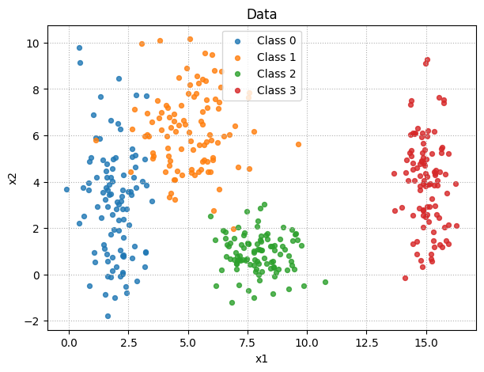
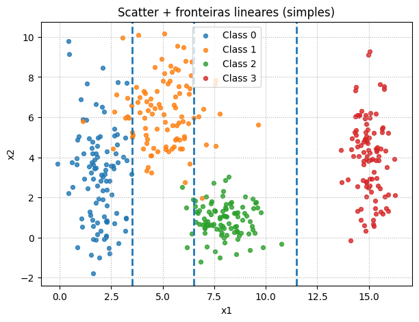

# **Exercício 1 — Data**

## Objetivo

O objetivo deste exercício foi **gerar um conjunto de dados sintéticos** em 2 dimensões para analisar sua **separabilidade entre classes**.  
Esse processo é importante porque ajuda a entender como uma rede neural simples ou mais profunda teria que se adaptar para classificar os dados corretamente.

---


## Etapa 1 — Geração dos Dados Sintéticos

O objetivo desta etapa foi criar um conjunto de **dados bidimensionais** (variáveis `x1` e `x2`) divididos em **4 classes distintas**, cada uma com **100 pontos**, totalizando **400 amostras**.

Para garantir reprodutibilidade, defini a semente do gerador de números aleatórios (`np.random.seed(42)`), o que faz com que os mesmos pontos sejam gerados a cada execução do código.

Cada classe foi gerada usando a função `np.random.normal`, que amostra valores de uma **distribuição normal (gaussiana)** a partir de um valor médio (`loc`) e um desvio padrão (`scale`). Assim:

- **Classe 0**: centrada em (2, 3), mais espalhada no eixo y (`scale=2.5`).  
- **Classe 1**: centrada em (5, 6), com variação moderada em ambos os eixos.  
- **Classe 2**: centrada em (8, 1), compacta em torno da média.  
- **Classe 3**: centrada em (15, 4), bem concentrada em `x1` mas com maior variação em `x2`.

Por fim, usei `np.column_stack` para juntar as duas variáveis (`x1`, `x2`) em um array bidimensional, representando os pontos de cada classe.

```python
np.random.seed(42)  
n = 100

# Classe 0
c0_x1 = np.random.normal(loc=2, scale=0.8, size=n)
c0_x2 = np.random.normal(loc=3, scale=2.5, size=n)
c0 = np.column_stack((c0_x1, c0_x2))

# Classe 1
c1_x1 = np.random.normal(loc=5, scale=1.2, size=n)
c1_x2 = np.random.normal(loc=6, scale=1.9, size=n)
c1 = np.column_stack((c1_x1, c1_x2))

# Classe 2
c2_x1 = np.random.normal(loc=8, scale=0.9, size=n)
c2_x2 = np.random.normal(loc=1, scale=0.9, size=n)
c2 = np.column_stack((c2_x1, c2_x2))

# Classe 3
c3_x1 = np.random.normal(loc=15, scale=0.5, size=n)
c3_x2 = np.random.normal(loc=4, scale=2.0, size=n)
c3 = np.column_stack((c3_x1, c3_x2))
```


## Etapa 2 — Visualização dos Dados

Com as quatro classes já geradas, o próximo passo foi **visualizar a distribuição dos pontos** em um gráfico de dispersão (*scatter plot*).

Esse gráfico é essencial porque permite **observar a separabilidade entre classes** e já adianta possíveis regiões de sobreposição que precisaremos analisar na próxima etapa.

```python
plt.figure(figsize=(7,5))
plt.scatter(c0[:,0], c0[:,1], label="Class 0", s=18, alpha=0.8)
plt.scatter(c1[:,0], c1[:,1], label="Class 1", s=18, alpha=0.8)
plt.scatter(c2[:,0], c2[:,1], label="Class 2", s=18, alpha=0.8)
plt.scatter(c3[:,0], c3[:,1], label="Class 3", s=18, alpha=0.8)

plt.title("Data")
plt.xlabel("x1"); plt.ylabel("x2")
plt.grid(True, linestyle=":", linewidth=0.8)
plt.legend()
plt.show()
```

 
/// caption 
Distribuição das classes
///

Observando o gráfico de dispersão obtido:

- **Classe 0 (azul):** está localizada à esquerda, centrada em torno de `x1 ≈ 2`.  
  Apresenta grande variação em `x2`, formando uma nuvem vertical que vai de valores negativos até acima de 7.  

- **Classe 1 (laranja):** posicionada mais ao centro, em `x1 ≈ 5`.  
  Distribui-se em níveis mais altos de `x2` (acima de 5), com dispersão considerável, o que gera **sobreposição com a Classe 0** em algumas regiões.  

- **Classe 2 (verde):** centrada em `x1 ≈ 8` e valores baixos de `x2` (por volta de 1).  
  É a classe mais **compacta**, com baixa dispersão, o que facilita sua identificação. No entanto, apresenta certa proximidade com a Classe 1 na região de fronteira.  

- **Classe 3 (vermelha):** bem afastada das demais, em `x1 ≈ 15`.  
  Mesmo com variação em `x2`, mantém-se completamente separada das outras classes, o que torna sua classificação a mais simples do conjunto.

### Conclusões sobre separabilidade

- Existe uma **ordem clara das classes ao longo do eixo `x1`**: C0 → C1 → C2 → C3.  
- Porém, as classes **0 e 1 apresentam sobreposição** em parte do espaço (principalmente entre `x1=2` e `x1=5`), o que dificulta a separação por um limite totalmente linear.  
- A Classe **2 é bem definida e isolada verticalmente**, embora esteja próxima da Classe 1 na horizontal.  
- A Classe **3 está completamente isolada**, sendo a mais fácil de separar.  


## Etapa 4 — Definição de Fronteiras Lineares Simples

Para explorar a separabilidade dos dados, tracei **fronteiras lineares verticais** ao longo do eixo `x1`, representando limites de decisão iniciais entre as classes.


```python
xlines = [
    (2 + 5) / 2,   
    (5 + 8) / 2,   
    (8 + 15) / 2   
]

plt.figure(figsize=(7,5))
plt.scatter(c0[:,0], c0[:,1], label="Class 0", s=18, alpha=0.8)
plt.scatter(c1[:,0], c1[:,1], label="Class 1", s=18, alpha=0.8)
plt.scatter(c2[:,0], c2[:,1], label="Class 2", s=18, alpha=0.8)
plt.scatter(c3[:,0], c3[:,1], label="Class 3", s=18, alpha=0.8)

for x in xlines:
    plt.axvline(x, linestyle="--", linewidth=2)

plt.title("Scatter + fronteiras lineares (simples)")
plt.xlabel("x1"); plt.ylabel("x2")
plt.grid(True, linestyle=":", linewidth=0.8)
plt.legend()
plt.show()
```

 
/// caption 
Divisão das classes
///

### Análise
- Esse método de fronteira **é simples e intuitivo**, funcionando bem quando as classes estão distribuídas principalmente em torno de valores diferentes de `x1`.  
- No entanto, ele **não considera a dispersão em `x2`**, o que gera problemas de sobreposição:  
  - Classes **0 e 1** continuam com regiões de confusão, pois se sobrepõem verticalmente.  
  - Classes **1 e 2** também podem apresentar mistura em regiões próximas à linha divisória.  
- A Classe **3, por estar bem afastada**, é separada de forma perfeita com esse limite linear.

### Implicação para redes neurais
- Um modelo linear simples poderia usar limites parecidos com estes para classificar os dados.  
- Porém, como há **sobreposição entre classes**, uma rede neural com múltiplas camadas e funções de ativação não lineares teria mais flexibilidade para **ajustar fronteiras curvas ou inclinadas**, capturando melhor as regiões de confusão.
