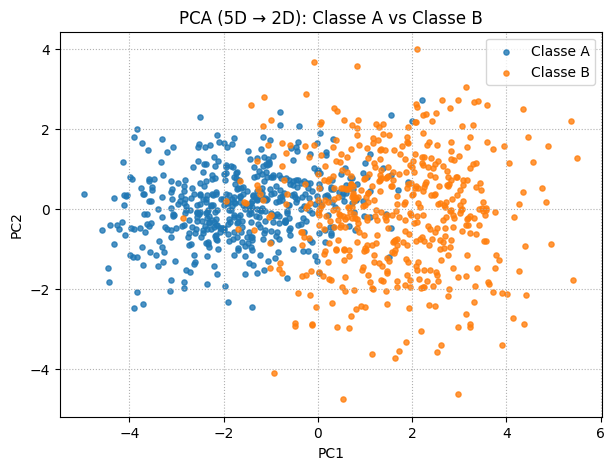

# **Exercicio 2 - Data** #

## Objetivo

O objetivo deste exercício foi criar dois conjuntos de dados em **5 dimensões** (Classes A e B), cada um com 500 amostras, a partir de distribuições normais multivariadas. Em seguida, reduzir a dimensionalidade com **PCA** para 2D e analisar a separabilidade linear.  

Minha hipótese inicial era de que, como as classes possuem **covariâncias diferentes**, a fronteira ótima não seria linear, representando um desafio para modelos simples como Perceptron ou Regressão Logística, e justificando o uso de modelos mais complexos (ex: redes neurais).

---


## Etapa 1 — Definição dos parâmetros e semente do gerador

Aqui eu preparei o **gerador de números aleatórios** e defini os parâmetros das distribuições normais multivariadas para as duas classes (A e B).

- `rng = np.random.default_rng(42)`  
  Criei um gerador pseudoaleatório com semente **42** para garantir **reprodutibilidade**. Isso significa que, ao rodar o código várias vezes, os mesmos dados serão gerados.

- `mu_A` e `mu_B`  
  São os **vetores de médias** das classes, cada um com 5 dimensões.  
  - Classe A é centrada na origem.  
  - Classe B é deslocada em relação à A (todas as médias iguais a 1.5).

- `Sigma_A` e `Sigma_B`  
  São as **matrizes de covariância** (5×5) que controlam o espalhamento e as correlações entre as variáveis de cada classe.  
  - Em A, há correlações positivas entre algumas variáveis.  
  - Em B, há correlações negativas e variâncias maiores.  

Esses parâmetros serão usados na função `rng.multivariate_normal` para **gerar os pontos** de cada classe na etapa seguinte.


```python
rng = np.random.default_rng(42)

mu_A = np.array([0., 0., 0., 0., 0.])
Sigma_A = np.array([
    [1.0, 0.8, 0.1, 0.0, 0.0],
    [0.8, 1.0, 0.3, 0.0, 0.0],
    [0.1, 0.3, 1.0, 0.5, 0.0],
    [0.0, 0.0, 0.5, 1.0, 0.2],
    [0.0, 0.0, 0.0, 0.2, 1.0],
])

mu_B = np.array([1.5, 1.5, 1.5, 1.5, 1.5])
Sigma_B = np.array([
    [1.5, -0.7, 0.2, 0.0, 0.0],
    [-0.7, 1.5, 0.4, 0.0, 0.0],
    [0.2, 0.4, 1.5, 0.6, 0.0],
    [0.0, 0.0, 0.6, 1.5, 0.3],
    [0.0, 0.0, 0.0, 0.3, 1.5],
])
```

## Etapa 2 — Amostragem dos dados e criação dos rótulos

Nesta parte eu realmente **gerei os pontos das duas classes** e preparei os conjuntos de dados e rótulos.

- `nA = nB = 500`  
  Defini que cada classe terá **500 amostras**, totalizando 1000 pontos.

- `rng.multivariate_normal(mean=..., cov=..., size=...)`  
  Função que gera amostras de uma **distribuição normal multivariada**.  
  - `mean` → vetor de médias da classe.  
  - `cov` → matriz de covariância que define variâncias e correlações.  
  - `size` → número de amostras a serem geradas.  
  Assim, `A` contém os pontos da Classe A (500×5) e `B` os da Classe B (500×5).

- `np.vstack([A, B])`  
  Empilhei os dois conjuntos verticalmente, formando a matriz `X` com shape (1000, 5).

- `np.hstack([np.zeros(nA, int), np.ones(nB, int)])`  
  Criei o vetor de rótulos `y`:  
  - `0` representa a Classe A.  
  - `1` representa a Classe B.  
  Isso me permite identificar de qual classe cada ponto pertence.

Com isso, foi finalizada a geração do **dataset 5D completo**, pronto para redução de dimensionalidade e análise.

```python
nA = nB = 500
A = rng.multivariate_normal(mean=mu_A, cov=Sigma_A, size=nA)
B = rng.multivariate_normal(mean=mu_B, cov=Sigma_B, size=nB)

X = np.vstack([A, B])           
y = np.hstack([np.zeros(nA, int), np.ones(nB, int)])
```

## Etapa 3 — Redução de dimensionalidade com PCA (5D → 2D)

Nesta etapa eu utilizei o **PCA (Principal Component Analysis)** para reduzir os dados de 5 dimensões para apenas 2, permitindo visualização em gráfico de dispersão.

- `pca = PCA(n_components=2, random_state=42)`  
  Criei um objeto PCA que mantém **apenas 2 componentes principais**.  
  - O PCA encontra direções de maior variância nos dados, ignorando rótulos de classe.

- `X2 = pca.fit_transform(X)`  
  Aqui eu **ajustei** o PCA aos dados 5D (`fit`) e **projetei** os pontos nesses dois eixos principais (`transform`).  
  O resultado é uma matriz `X2` com shape (1000, 2), representando cada amostra em duas dimensões (PC1 e PC2).

- `df["pc1"] = X2[:, 0]` e `df["pc2"] = X2[:, 1]`  
  Adicionei as duas novas colunas ao DataFrame para facilitar visualização e plotagem.

- `pca.explained_variance_ratio_`  
  Essa função retorna quanto da **variância total dos dados originais** foi preservada por cada componente.  
  - O `print` mostra a variância explicada por PC1 e PC2 separadamente.  
  - Também calculei a soma, para verificar quanta informação 5D conseguimos reter em 2D.

```python
pca = PCA(n_components=2, random_state=42)
X2 = pca.fit_transform(X)
df["pc1"] = X2[:, 0]
df["pc2"] = X2[:, 1]

print("Variância explicada (PC1, PC2):", np.round(pca.explained_variance_ratio_, 3))
print("Soma da variância explicada:", np.round(pca.explained_variance_ratio_.sum(), 3))
```

## Etapa 4 — Visualização gráfica das classes no espaço 2D

Nesta etapa eu fiz a **visualização final dos dados** após a redução de dimensionalidade com PCA.  
Usei o **Matplotlib** para criar um gráfico de dispersão que mostra as duas classes projetadas no plano formado pelos dois componentes principais (PC1 e PC2).

Esse gráfico permite **comparar visualmente** como as duas classes se distribuem em 2D e perceber se existe ou não **separação linear** entre elas.

```python
plt.figure(figsize=(7, 5))
plt.scatter(df.loc[df["class"] == 0, "pc1"], df.loc[df["class"] == 0, "pc2"],
            s=14, alpha=0.8, label="Classe A")
plt.scatter(df.loc[df["class"] == 1, "pc1"], df.loc[df["class"] == 1, "pc2"],
            s=14, alpha=0.8, label="Classe B")
plt.title("PCA (5D → 2D): Classe A vs Classe B")
plt.xlabel("PC1"); plt.ylabel("PC2")
plt.grid(True, linestyle=":", linewidth=0.8)
plt.legend()
plt.show()
```

 
/// caption 
Distribuição das classes
///

**Separabilidade linear (análise final):**

Na projeção em 2D, é possível perceber que as duas classes não ficam totalmente separadas: há regiões onde os pontos de A e B se misturam. Mesmo considerando os dados no espaço original de 5 dimensões, a forma como as duas classes estão distribuídas faz com que **uma linha reta não seja suficiente para dividi-las corretamente**.

Isso significa que modelos simples que trabalham apenas com separações retas, como o Perceptron, não conseguem representar bem esse tipo de situação.  
Por outro lado, modelos mais avançados, como redes neurais, conseguem criar **fronteiras curvas e mais flexíveis**, o que permite distinguir melhor as duas classes mesmo quando elas não estão separadas de forma simples.
