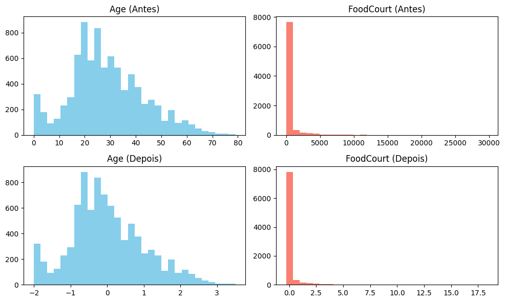

# **Exercício 3 — DATA**

O objetivo é preparar o conjunto de dados **Spaceship Titanic (train.csv do Kaggle)** para uso em uma rede neural que utiliza a função de ativação **tanh**.  

A seguir, realizei o passo a passo de carregamento, exploração, tratamento de nulos, codificação de variáveis categóricas e padronização de numéricas, além de visualizar o impacto do pré-processamento.

---

## Etapa 1 — Carregamento e descrição do dataset

O arquivo `train.csv` contém cerca de **8700 passageiros**.  
Cada linha representa um passageiro, com informações pessoais, dados de viagem e gastos.  
A coluna **`Transported`** é o alvo (True/False), indicando se o passageiro foi transportado para outra dimensão.

Principais tipos de variáveis:
- **Identificação:** `PassengerId`, `Name` .
- **Categóricas:** `HomePlanet`, `CryoSleep`, `Cabin`, `Destination`, `VIP`.
- **Numéricas:** `Age`, `RoomService`, `FoodCourt`, `ShoppingMall`, `Spa`, `VRDeck`.
- **Alvo:** `Transported`.


```python
import pandas as pd

df = pd.read_csv("data/train.csv")
display(df.head())
print(df.info())
print(df.isnull().sum())
```

### **Valores ausentes**

Após carregar o dataset `train.csv`, percebi que ele possui **8693 linhas** e **14 colunas**.  
Algumas variáveis apresentam valores ausentes, enquanto outras estão completas:

- **Sem valores ausentes:**
  - `PassengerId` → identificador único de cada passageiro.  
  - `Transported` → variável alvo (true ou false para saber se o passageiro foi transportado).

- **Com valores ausentes:**
  - `HomePlanet` (201) → planeta de origem.  
  - `CryoSleep` (217) → se o passageiro estava em criossuspensão.  
  - `Cabin` (199) → cabine onde estava hospedado.  
  - `Destination` (182) → planeta de destino.  
  - `Age` (179) → idade do passageiro.  
  - `VIP` (203) → se contratou serviço VIP.  
  - `RoomService` (181), `FoodCourt` (183), `ShoppingMall` (208), `Spa` (183), `VRDeck` (188) → gastos.  
  - `Name` (200) → nome do passageiro.

### Observações
- O conjunto apresenta **valores faltantes em quase todas as colunas de entrada**.  
- O percentual de valores ausentes em cada coluna é relativamente pequeno (entre 2% e 3% do total de linhas), ou seja, é viável aplicar técnicas de **preenchimento**  em vez de descartar linhas inteiras.  


## Etapa 2 — Definição dos tipos de variáveis

- **Numéricas:** `Age`, `RoomService`, `FoodCourt`, `ShoppingMall`, `Spa`, `VRDeck`.  
- **Categóricas:** `HomePlanet`, `CryoSleep`, `Cabin`, `Destination`, `VIP`.  
- **Alvo:** `Transported`.


## Etapa 3 — Tratamento de valores ausentes

Pelo `df.info()` e `df.isnull().sum()`:
- Há nulos em quase todas as colunas de entrada (entre ~179 e ~217 linhas por coluna, ≈2%–3% do total de 8693).

**Estratégia adotada:**
1. **Categóricas** (`HomePlanet`, `CryoSleep`, `Cabin`, `Destination`, `VIP`):
   - Preencher com a **moda** (valor mais frequente).
   - Para `Cabin`, além de preencher, **separar em `Deck`/`Num`/`Side`** (formato `deck/num/side`), pois é uma string composta que carrega informação útil.
2. **Numéricas** (`Age`, `RoomService`, `FoodCourt`, `ShoppingMall`, `Spa`, `VRDeck`):
   - Preencher com a **mediana** (robusta a outliers).
   - Regra de negócio adicional: se `CryoSleep == True`, os gastos deveriam ser **zero** (passageiro confinado à cabine). Assim, nulos nos gastos para quem está em `CryoSleep` serão imputados com **0**; os demais, com **mediana**.


## Etapa 3.1 — Preparos para imputação

Antes de imputar:
- Defino listas auxiliares de colunas.
- Converto `CryoSleep` e `VIP` para booleanos/bits depois de preencher (eles vieram como `object` por causa dos NaNs).
- Para `Cabin`, separo em três colunas (`Deck`, `Num`, `Side`), imputo `Deck`/`Side` com a **moda** e `Num` com a **mediana** (numérica).


```python
num_cols = ["Age", "RoomService", "FoodCourt", "ShoppingMall", "Spa", "VRDeck"]
cat_cols = ["HomePlanet", "CryoSleep", "Cabin", "Destination", "VIP"]  # Cabin será expandida
target = "Transported"

cabin_split = df["Cabin"].str.split("/", expand=True)
df["Deck"] = cabin_split[0]
df["Num"]  = pd.to_numeric(cabin_split[1], errors="coerce")  # numérico
df["Side"] = cabin_split[2]

cat_cols_expanded = ["HomePlanet", "CryoSleep", "Destination", "VIP", "Deck", "Side"]
num_cols_expanded = num_cols + ["Num"]
```

## Etapa 3.2 — Imputação das categóricas

**Regra:** preencher categóricas com a **moda** (valor mais frequente).  
Depois, padronizo `CryoSleep` e `VIP` para inteiros 0/1 (necessário para modelos e para aplicar a regra dos gastos = 0 se em criossono).

```python
for col in ["HomePlanet", "Destination", "Deck", "Side", "CryoSleep", "VIP"]:
    df[col] = df[col].fillna(df[col].mode()[0])

def to_bool01(series):
    return (
        series
        .replace({True: 1, False: 0, "True": 1, "False": 0, "TRUE": 1, "FALSE": 0})
        .astype(int)
    )

df["CryoSleep"] = to_bool01(df["CryoSleep"])
df["VIP"]       = to_bool01(df["VIP"])

# Alvo (já veio bool, mas garanto 0/1)
df["Transported"] = df["Transported"].astype(int)
```

## Etapa 3.3 — Imputação das numéricas

**Regra geral:** imputar **mediana**.  
**Regra de negócio adicional para gastos:** se `CryoSleep == 1`, nulos em gastos (`RoomService`, `FoodCourt`, `ShoppingMall`, `Spa`, `VRDeck`) viram **0**; os demais nulos seguem para **mediana**.

Para `Num` (número da cabine, derivado de `Cabin`), uso **mediana**.

```python
spend_cols = ["RoomService", "FoodCourt", "ShoppingMall", "Spa", "VRDeck"]

for col in spend_cols:
    mask = (df["CryoSleep"] == 1) & (df[col].isna())
    df.loc[mask, col] = 0.0

for col in num_cols_expanded:
    df[col] = df[col].fillna(df[col].median())
```

## Etapa 3.4 — Limpeza final desta etapa

- `Cabin` original é removida (substituída por `Deck`, `Num`, `Side`).
- `Name` não será usado como atributo neste exercício (texto livre), então removo.
- Faço uma checagem final para garantir **zero valores ausentes** nas colunas que seguem para o modelo.


```python
df = df.drop(columns=["Cabin", "Name"])

missing_total = df.isnull().sum().sum()
print(f"valores ausentes: {missing_total}")
```

## Etapa 3.5 — Comentários e justificativas

- **Moda nas categóricas**: mantém a coerência dos dados e evita criar categorias artificiais com baixa frequência.
- **Mediana nas numéricas**: é robusta a valores extremos (outliers), comuns nas colunas de gastos.
- **Regra de gastos = 0 em CryoSleep**: condiz com a definição do problema (passageiros em criossono ficam na cabine e não consomem serviços).
- **Separar `Cabin` em `Deck`/`Num`/`Side`**: aproveita a estrutura da informação, em vez de tratá-la como uma string opaca. `Deck` e `Side` entram como categóricas; `Num`, como numérica.
- **Remover `Name`**: campo textual livre, de pouca utilidade neste exercício de pré-processamento para uma MLP com `tanh` (sem embeddings/PLN). Pode ser reintroduzido em projetos onde se extraem sobrenomes/grupos.
- Após estas decisões, o dataset está **livre de nulos** e pronto para **codificação categórica** e **escalonamento** (próximas etapas).


## Etapa 4 — Codificação de variáveis categóricas

Para treinar uma rede neural, todas as entradas precisam estar em **formato numérico**.

- Variáveis **binárias**:  
  - `CryoSleep` e `VIP` já foram convertidas para 0/1.  
- Variáveis **multiclasse**:  
  - `HomePlanet`, `Destination`, `Deck`, `Side` → apliquei **One-Hot Encoding**, criando colunas dummy (0/1).  

Assim, todas as categorias foram transformadas em indicadores numéricos sem introduzir ordens artificiais.


```python
df = pd.get_dummies(df, columns=["HomePlanet", "Destination", "Deck", "Side"], drop_first=True)

display(df.head())
```

## Etapa 5 — Escalonamento dos atributos numéricos

A função de ativação **tanh** é centrada em zero e gera saídas em [-1, 1].  
Portanto, é essencial que as variáveis numéricas estejam **padronizadas** para:
- média = 0  
- desvio padrão = 1  

Isso melhora a estabilidade do treinamento e acelera a convergência.  
Para isso, usei `StandardScaler` da biblioteca `scikit-learn`.


```python
from sklearn.preprocessing import StandardScaler

num_cols_final = ["Age", "RoomService", "FoodCourt", "ShoppingMall", "Spa", "VRDeck", "Num"]

scaler = StandardScaler()
df[num_cols_final] = scaler.fit_transform(df[num_cols_final])

display(df[num_cols_final].head())
```


## Etapa 6 — Visualização do impacto do pré-processamento

Para evidenciar a transformação feita, comparei a distribuição de variáveis numéricas antes e depois do escalonamento:

- **Idade (`Age`)**: mostra como foi centralizada em torno de zero e ajustada em escala.  
- **Gasto em `FoodCourt`**: mostra como valores muito altos foram reduzidos para uma escala padrão, sem alterar a forma da distribuição.

Isso comprova que os dados foram preparados corretamente para uso em uma rede neural com `tanh`.


```python
import matplotlib.pyplot as plt

# Dados originais para comparação
df_raw = pd.read_csv("data/train.csv")

fig, axes = plt.subplots(2, 2, figsize=(10,6))

# Antes
axes[0,0].hist(df_raw["Age"].dropna(), bins=30, color="skyblue")
axes[0,0].set_title("Age (Antes)")

axes[0,1].hist(df_raw["FoodCourt"].dropna(), bins=30, color="salmon")
axes[0,1].set_title("FoodCourt (Antes)")

# Depois
axes[1,0].hist(df["Age"], bins=30, color="skyblue")
axes[1,0].set_title("Age (Depois)")

axes[1,1].hist(df["FoodCourt"], bins=30, color="salmon")
axes[1,1].set_title("FoodCourt (Depois)")

plt.tight_layout()
plt.show()
```

 
/// caption 
Comparação pré-pós processamento
///