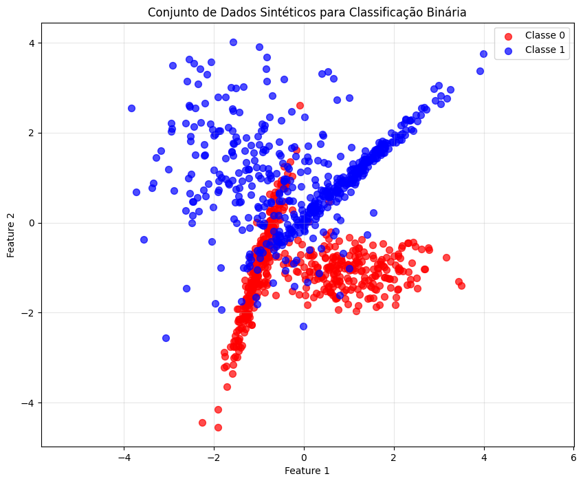
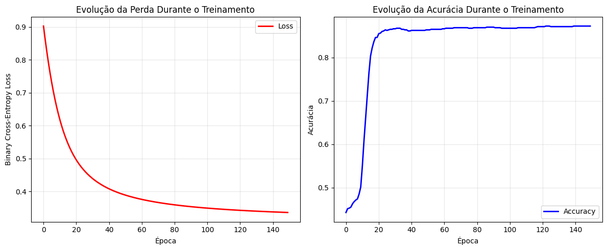
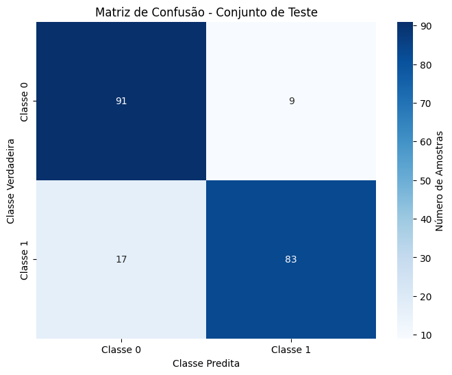
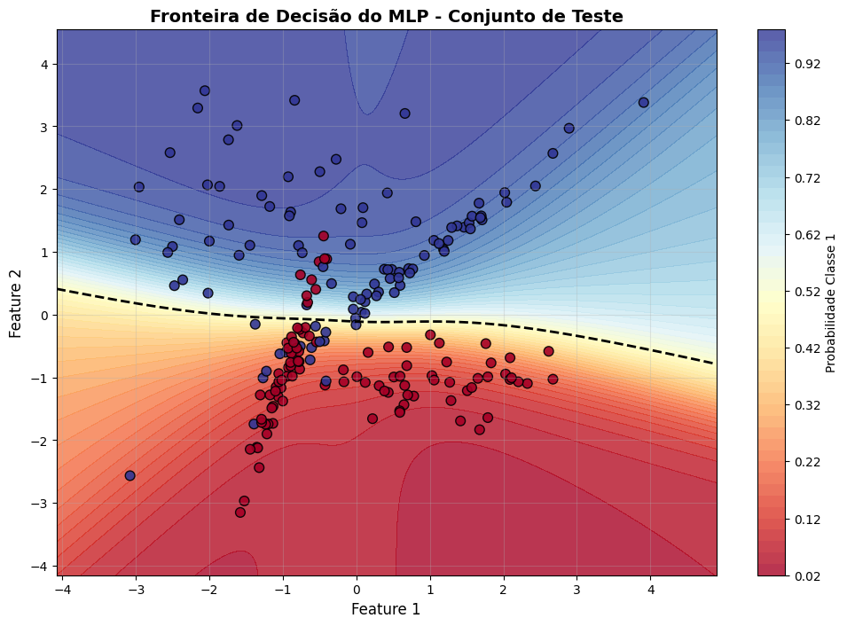

# **Exercício 2: MLP**

---

## **Objetivo**

Implementar um **Multi-Layer Perceptron (MLP) do zero** para resolver um problema de classificação binária, utilizando apenas a biblioteca **NumPy** para cálculos matemáticos. Este exercício demonstra na prática como construir, treinar e avaliar uma rede neural artificial sem o uso de frameworks de deep learning.

### **Especificações Técnicas:**
- **Dataset**: 1000 amostras sintéticas com 2 features
- **Classes**: 2 (classificação binária)
- **Arquitetura**: 2 → 8 → 1 neurônios
- **Funções de Ativação**: tanh (camada oculta) + sigmoid (saída)
- **Função de Perda**: Binary Cross-Entropy
- **Otimizador**: Gradient Descent

---

## **1. Configuração Inicial e Importação de Bibliotecas**

Antes de começar a implementação, precisamos importar as bibliotecas necessárias e configurar o ambiente de desenvolvimento. Vamos usar NumPy para operações matemáticas, Matplotlib/Seaborn para visualizações e Scikit-learn apenas para geração de dados sintéticos e métricas de avaliação.

```python
import numpy as np
import matplotlib.pyplot as plt
from sklearn.datasets import make_classification
from sklearn.model_selection import train_test_split
from sklearn.metrics import accuracy_score, precision_score, recall_score, f1_score, confusion_matrix
import seaborn as sns

np.set_printoptions(precision=4, suppress=True)
plt.style.use('default')

```

---

## **2. Geração e Preparação dos Dados**

### **2.1 Criação do Dataset Sintético**

Vamos criar um conjunto de dados artificiais para classificação binária. O Scikit-learn possui uma função específica para isso que nos permite controlar características como número de amostras, features e complexidade da separação entre classes.

**O que este código faz:**

- Gera 1000 amostras com 2 features cada
- Cria 2 classes balanceadas (500 amostras cada)
- Configura 2 clusters por classe para tornar o problema mais interessante
- Adiciona um pequeno ruído (1%) para simular dados reais

```python
n_samples = 1000
n_features = 2
n_clusters_per_class = 2
n_informative = 2
n_redundant = 0
random_state = 42

X, y = make_classification(
    n_samples=n_samples,
    n_features=n_features,
    n_informative=n_informative,
    n_redundant=n_redundant,
    n_clusters_per_class=n_clusters_per_class,
    random_state=random_state,
    flip_y=0.01
)

```

### **2.2 Visualização dos Dados**

É fundamental visualizar os dados antes de treinar qualquer modelo. Isso nos ajuda a entender a distribuição das classes, identificar possíveis padrões e avaliar a complexidade do problema de classificação.

**O que este código faz:**

- Cria um scatter plot das duas classes
- Mostra a distribuição espacial dos pontos no espaço 2D

```python
plt.figure(figsize=(10, 8))

colors = ['red', 'blue']
labels = ['Classe 0', 'Classe 1']

for i in range(2):
    mask = y == i
    plt.scatter(X[mask, 0], X[mask, 1], 
               c=colors[i], label=labels[i], 
               alpha=0.7, s=50)

plt.xlabel('Feature 1')
plt.ylabel('Feature 2')
plt.title('Conjunto de Dados Sintéticos para Classificação Binária')
plt.legend()
plt.grid(True, alpha=0.3)
plt.axis('equal')
plt.show()

```




### **2.3 Divisão e Normalização dos Dados**

Antes de treinar o modelo, precisamos dividir os dados em conjuntos de treino e teste, além de normalizar os features. A normalização é crucial para MLPs, pois garante que todas as features tenham a mesma escala, evitando que features com valores maiores dominem o processo de aprendizagem.

**O que este código faz:**

- Divide dados em 80% treino e 20% teste
- Mantém a proporção das classes em ambos os conjuntos 
- Normaliza os dados usando Z-score (média=0, desvio=1)
- Aplica a mesma normalização do treino no conjunto de teste

```python
X_train, X_test, y_train, y_test = train_test_split(
    X, y, 
    test_size=0.2, 
    random_state=42, 
    stratify=y
)


# normalizacao
X_train_mean = X_train.mean(axis=0)
X_train_std = X_train.std(axis=0)

X_train_norm = (X_train - X_train_mean) / X_train_std
X_test_norm = (X_test - X_train_mean) / X_train_std
```

---

## **3. Implementação da Classe MLP**

### **3.1 Estrutura Principal e Inicialização**

Vamos criar uma classe que encapsula toda a funcionalidade do nosso MLP. A inicialização é um passo crítico, pois determina os valores iniciais dos pesos e bias que a rede usará para começar o aprendizado.

**O que este código faz:**

- Inicializa pesos com valores pequenos e aleatórios
- Inicializa bias com zeros

```python
class MLP:
    
    def __init__(self, learning_rate=0.05):
        self.learning_rate = learning_rate
        
        hidden_size = 12
        
        self.W1 = np.random.randn(hidden_size, 2) * np.sqrt(2.0 / 2)
        self.b1 = np.zeros((hidden_size, 1))
        self.W2 = np.random.randn(1, hidden_size) * np.sqrt(2.0 / hidden_size)
        self.b2 = np.zeros((1, 1))
        
        self.loss_history = []
```

### **3.2 Funções de Ativação e suas Derivadas**

As funções de ativação são fundamentais para permitir que a rede neural aprenda padrões não-lineares. Implementamos tanh para a camada oculta (permite valores negativos e positivos) e sigmoid para a saída (valores entre 0 e 1, ideal para probabilidades).

**O que este código faz:**

- Implementa a função tanh e sua derivada
- Implementa a função sigmoid com proteção contra overflow
- As derivadas são necessárias para o algoritmo de backpropagation

```python
def tanh(self, z):
    return np.tanh(z)

def tanh_derivative(self, z):
    """Derivada da tanh: d/dz tanh(z) = 1 - tanh²(z)"""
    return 1 - np.tanh(z)**2

def sigmoid(self, z):
    """Função sigmoid: saída entre 0 e 1"""
    z_clipped = np.clip(z, -500, 500)
    return 1 / (1 + np.exp(-z_clipped))

MLP.tanh = tanh
MLP.tanh_derivative = tanh_derivative
MLP.sigmoid = sigmoid

```

### **3.3 Forward Pass (Propagação Adiante)**

O forward pass é responsável por processar os dados de entrada através de todas as camadas da rede até produzir a saída final. Este é o processo de "predição" da rede neural.

**O que este código faz:**

- Recebe dados de entrada e os propaga através da rede
- Aplica transformações lineares (multiplicação matricial + bias)
- Aplica funções de ativação não-lineares
- Armazena valores intermediários (cache) para usar no backpropagation
- Retorna tanto a saída final quanto o cache

```python
def forward(self, X):
    """
    Forward pass: propaga dados através da rede.
    
    Args:
        X: dados de entrada (n_samples, n_features)
    
    Returns:
        A2: saída da rede (probabilidades)
        cache: valores intermediários para backprop
    """
    if X.ndim == 1:
        X = X.reshape(1, -1)
    A0 = X.T
    
    # camada oculta: transformação + ativação
    Z1 = self.W1 @ A0 + self.b1  
    A1 = self.tanh(Z1)           
    
    # camada de saída: transformação + ativação
    Z2 = self.W2 @ A1 + self.b2  
    A2 = self.sigmoid(Z2)        
    
    cache = {
        'A0': A0,  # Entrada
        'Z1': Z1,  # Pré-ativação camada oculta
        'A1': A1,  # Ativação camada oculta
        'Z2': Z2,  # Pré-ativação saída
        'A2': A2   # Ativação saída (probabilidade)
    }
    
    return A2, cache

def predict_proba(self, X):
    """Retorna probabilidades de classificação"""
    output, _ = self.forward(X)
    return output.T

def predict(self, X):
    """Retorna predições binárias (0 ou 1)"""
    probabilities = self.predict_proba(X)
    return (probabilities > 0.5).astype(int).flatten()

MLP.forward = forward
MLP.predict_proba = predict_proba
MLP.predict = predict

```

### **3.4 Função de Perda e Backward Pass**

A função de perda mede quão distantes estão nossas predições dos valores reais. O backward pass (backpropagation) calcula como cada parâmetro da rede deve ser ajustado para reduzir essa perda.

**O que este código faz:**

- Implementa Binary Cross-Entropy Loss
- Calcula gradientes de todos os parâmetros usando a regra da cadeia
- Propaga o erro da saída de volta para todas as camadas
- Retorna gradientes para atualização dos parâmetros

```python
def compute_loss(self, y_true, y_pred):
    """    
    Args:
        y_true: labels verdadeiros (0 ou 1)
        y_pred: probabilidades preditas (0 a 1)
    
    Returns:
        loss: valor da perda (menor é melhor)
    """
    baixo = 1e-15
    y_pred_clipped = np.clip(y_pred, baixo, 1 - baixo)
    
    loss = -np.mean(y_true * np.log(y_pred_clipped) + 
                   (1 - y_true) * np.log(1 - y_pred_clipped))
    return loss

def backward(self, X, y, cache):
    """    
    Args:
        X: dados de entrada
        y: labels verdadeiros
        cache: valores do forward pass
    
    Returns:
        gradientes de todos os parâmetros
    """
    m = X.shape[0]
    
    A0, A1, A2 = cache['A0'], cache['A1'], cache['A2']
    Z1 = cache['Z1']
    
    y_reshaped = y.reshape(1, -1)
    dZ2 = A2 - y_reshaped
    
    dW2 = (1/m) * np.dot(dZ2, A1.T)  # dL/dW2
    db2 = (1/m) * np.sum(dZ2, axis=1, keepdims=True)  # dL/db2
    
    dA1 = np.dot(self.W2.T, dZ2)  # dL/dA1
    dZ1 = dA1 * self.tanh_derivative(Z1)  # dL/dZ1
    
    dW1 = (1/m) * np.dot(dZ1, A0.T)  # dL/dW1
    db1 = (1/m) * np.sum(dZ1, axis=1, keepdims=True)  # dL/db1
    
    return dW1, db1, dW2, db2

MLP.compute_loss = compute_loss
MLP.backward = backward
```

### **3.5 Loop de Treinamento Principal**

O método de treinamento coordena todo o processo de aprendizagem: executa forward passes, calcula perdas, executa backward passes e atualiza parâmetros repetidamente até a rede convergir.

**O que este código faz:**

- Executa múltiplas épocas de treinamento
- Para cada época: forward → loss → backward → update
- Atualiza parâmetros usando Gradient Descent
- Monitora progresso (perda e acurácia) durante treinamento

```python
def fit(self, X_train, y_train, epochs=150, print_every=30):
    """    
    Args:
        X_train: dados de treinamento (n_samples, n_features)
        y_train: labels de treinamento (n_samples,)
        epochs: número de épocas de treinamento
    """
    self.loss_history = []
    self.accuracy_history = []
    
    print(f"------ Iniciando treino ------")
    print(f"Épocas: {epochs}")
    print(f"Amostras de treino: {X_train.shape[0]}")
    print(f"Learning rate: {self.learning_rate}")
    
    for epoch in range(epochs):
        # forward pass
        output, cache = self.forward(X_train)
        y_pred = output.flatten()
        
        # perda
        loss = self.compute_loss(y_train, y_pred)
        self.loss_history.append(loss)
        
        # acuracia
        predictions = (y_pred > 0.5).astype(int)
        accuracy = np.mean(predictions == y_train)
        self.accuracy_history.append(accuracy)
        
        # backward pass
        dW1, db1, dW2, db2 = self.backward(X_train, y_train, cache)
        
        # atualiza os parametros
        self.W1 -= self.learning_rate * dW1
        self.b1 -= self.learning_rate * db1
        self.W2 -= self.learning_rate * dW2
        self.b2 -= self.learning_rate * db2
        
        if (epoch + 1) % print_every == 0:
            print(f"Época {epoch+1:3d}/{epochs} - Loss: {loss:.4f} - Acc: {accuracy:.4f}")
    
    print(f"\n ---------- fim do treino --------")
    print(f"Loss final: {self.loss_history[-1]:.6f}")
    print(f"Acurácia final no treino: {self.accuracy_history[-1]:.4f}")

MLP.fit = fit
```

---

## **4. Treinamento do Modelo**

### **4.1 Instanciação e Configuração**

Agora vamos criar uma instância da nossa classe MLP e configurar os hiperparâmetros de treinamento. A escolha do learning rate é crucial: muito alto pode causar instabilidade, muito baixo pode tornar o treinamento lento.

**O que este código faz:**

- Cria uma instância do MLP
- Inicializa todos os pesos e bias automaticamente
- Prepara a rede para receber dados de treinamento

```python
model = MLP(learning_rate=0.05)
```

### **4.2 Execução do Treinamento**

Este é o momento principal onde nossa rede neural aprende os padrões dos dados. O processo pode levar alguns segundos e você verá o progresso da perda e acurácia sendo impresso.

**O que este código faz:**

- Executa 150 épocas de treinamento
- Mostra progresso a cada 30 épocas
- A perda deve diminuir e a acurácia deve aumentar ao longo do tempo
- Salva histórico para posterior visualização

```python

model.fit(X_train_norm, y_train, epochs=150, print_every=30)

print(f"Perda final: {model.loss_history[-1]:.6f}")
print(f"Acurácia final: {model.accuracy_history[-1]:.4f}")
```

```
------ Iniciando treino ------
Épocas: 150
Amostras de treino: 800
Learning rate: 0.05
Época  30/150 - Loss: 0.4429 - Acc: 0.8662
Época  60/150 - Loss: 0.3767 - Acc: 0.8662
Época  90/150 - Loss: 0.3540 - Acc: 0.8700
Época 120/150 - Loss: 0.3426 - Acc: 0.8712
Época 150/150 - Loss: 0.3358 - Acc: 0.8725

 ---------- fim do treino --------
Loss final: 0.335833
Acurácia final no treino: 0.8725
Perda final: 0.335833
Acurácia final: 0.8725
```

---

## **5. Avaliação e Análise dos Resultados**

### **5.1 Métricas de Desempenho no Conjunto de Teste**

Após o treinamento, precisamos avaliar como o modelo se comporta em dados que nunca viu antes (conjunto de teste). Isso nos dá uma medida real da capacidade de generalização do modelo.

**O que este código faz:**

- Faz predições no conjunto de teste
- Calcula métricas abrangentes de classificação
- Compara desempenho entre treino e teste
- Identifica possível overfitting ou underfitting

```python

y_pred_test = model.predict(X_test_norm)
y_pred_proba_test = model.predict_proba(X_test_norm).flatten()

accuracy = accuracy_score(y_test, y_pred_test)
precision = precision_score(y_test, y_pred_test)
recall = recall_score(y_test, y_pred_test)
f1 = f1_score(y_test, y_pred_test)
test_loss = model.compute_loss(y_test, y_pred_proba_test)

print(f"Acurácia:     {accuracy:.4f}")
print(f"Precisão:     {precision:.4f}")
print(f"Recall:       {recall:.4f}")
print(f"F1-Score:     {f1:.4f}")
print(f"Loss (teste): {test_loss:.4f}")

# treino vs teste
train_accuracy = model.accuracy_history[-1]
print(f"Acurácia Treino: {train_accuracy:.4f}")
print(f"Acurácia Teste:  {accuracy:.4f}")
print(f"Diferença:       {abs(train_accuracy - accuracy):.4f}")
```

```
Acurácia:     0.8700
Precisão:     0.9022
Recall:       0.8300
F1-Score:     0.8646
Loss (teste): 0.3496
Acurácia Treino: 0.8725
Acurácia Teste:  0.8700
Diferença:       0.0025
```
A diferença entre o treino e o teste foi bem pequena, o que mostra que o modelo esta bem generalizado

### **5.2 Visualização da Curva de Treinamento**

A visualização da evolução da perda durante o treinamento nos ajuda a entender se o modelo convergiu adequadamente e se o learning rate foi apropriado.

**O que este código faz:**

- Plota a curva de perda ao longo das épocas
- Mostra se houve convergência suave
- Permite identificar problemas como oscilações ou saturação
- Ajuda a determinar se mais épocas seriam necessárias

```python
plt.figure(figsize=(12, 5))

plt.subplot(1, 2, 1)
plt.plot(model.loss_history, linewidth=2, color='red', label='Loss')
plt.title('Evolução da Perda Durante o Treinamento')
plt.xlabel('Época')
plt.ylabel('Binary Cross-Entropy Loss')
plt.grid(True, alpha=0.3)
plt.legend()

plt.subplot(1, 2, 2)
plt.plot(model.accuracy_history, linewidth=2, color='blue', label='Accuracy')
plt.title('Evolução da Acurácia Durante o Treinamento')
plt.xlabel('Época')
plt.ylabel('Acurácia')
plt.grid(True, alpha=0.3)
plt.legend()

plt.tight_layout()
plt.show()
```




### **5.3 Matriz de Confusão**

A matriz de confusão oferece uma visão detalhada de onde o modelo está acertando e errando, permitindo identificar se há viés para alguma classe específica.

**O que este código faz:**

- Cria matriz de confusão com visualização clara
- Mostra verdadeiros positivos, falsos positivos, etc.
- Calcula estatísticas detalhadas por classe
- Identifica padrões de erro do modelo

```python
cm = confusion_matrix(y_test, y_pred_test)

plt.figure(figsize=(8, 6))
sns.heatmap(cm, annot=True, fmt='d', cmap='Blues', 
            xticklabels=['Classe 0', 'Classe 1'], 
            yticklabels=['Classe 0', 'Classe 1'],
            cbar_kws={'label': 'Número de Amostras'})
plt.title('Matriz de Confusão - Conjunto de Teste')
plt.ylabel('Classe Verdadeira')
plt.xlabel('Classe Predita')
plt.show()

```



```
Verdadeiros Negativos (TN): 91
Falsos Positivos (FP):      9
Falsos Negativos (FN):      17
Verdadeiros Positivos (TP): 83
```


### **5.4 Visualização da Fronteira de Decisão**

Uma das visualizações mais importantes é a fronteira de decisão, que mostra como o modelo separa as classes no espaço de features. Isso nos dá uma intuição visual de como a rede neural "pensa".

**O que este código faz:**

- Cria um grid denso de pontos no espaço de features
- Calcula a probabilidade de cada ponto pertencer à classe 1
- Visualiza a fronteira de decisão como um mapa de calor
- Sobrepõe os pontos reais do conjunto de teste

```python
def plot_decision_boundary(model, X, y, title="Fronteira de Decisão do MLP"):
    """    
    Args:
        model: modelo treinado
        X: dados para plotar
        y: labels correspondentes
    """
    h = 0.02 
    x_min, x_max = X[:, 0].min() - 1, X[:, 0].max() + 1
    y_min, y_max = X[:, 1].min() - 1, X[:, 1].max() + 1
    xx, yy = np.meshgrid(np.arange(x_min, x_max, h),
                         np.arange(y_min, y_max, h))
    
    grid_points = np.c_[xx.ravel(), yy.ravel()]
    grid_normalized = (grid_points - X_train_mean) / X_train_std
    
    Z = model.predict_proba(grid_normalized)
    Z = Z.reshape(xx.shape)
    
    plt.figure(figsize=(12, 8))
    
    contour = plt.contourf(xx, yy, Z, levels=50, alpha=0.8, cmap=plt.cm.RdYlBu)
    plt.colorbar(contour, label='Probabilidade Classe 1')
    
    scatter = plt.scatter(X[:, 0], X[:, 1], c=y, cmap=plt.cm.RdYlBu, 
                         edgecolors='black', s=60, alpha=0.9)
    
    plt.xlabel('Feature 1', fontsize=12)
    plt.ylabel('Feature 2', fontsize=12)
    plt.title(title, fontsize=14, fontweight='bold')
    
    plt.contour(xx, yy, Z, levels=[0.5], colors='black', linestyles='--', linewidths=2)
    
    plt.grid(True, alpha=0.3)
    plt.show()

plot_decision_boundary(model, X_test, y_test, 
                      "Fronteira de Decisão do MLP - Conjunto de Teste")

```




---

## **6. Análise dos Resultados e Insights**

## Conclusão Geral

O MLP com **tanh** nas camadas ocultas e **sigmoid** na saída se **adaptou bem** ao padrão dos dados. A fronteira aprendida é **suave e não linear**, capturando variações gradativas entre as classes (característica da `tanh`) e entregando **probabilidades calibradas** via `sigmoid`. 
No conjunto de teste, o modelo apresentou **bom desempenho geral** (acurácia ~87% e F1 ~0.86), com **leve viés pró-precisão** (mais conservador para marcar a classe positiva). Em resumo, a arquitetura escolhida foi **adequada ao problema** e produziu uma separação coerente com a distribuição dos pontos.
