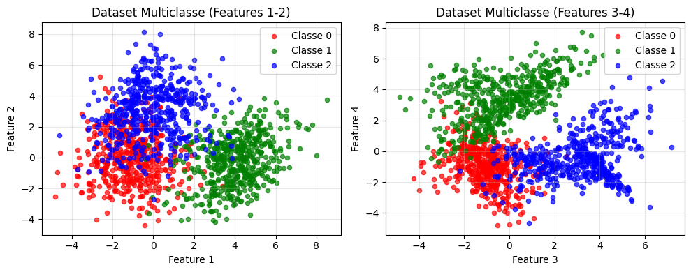
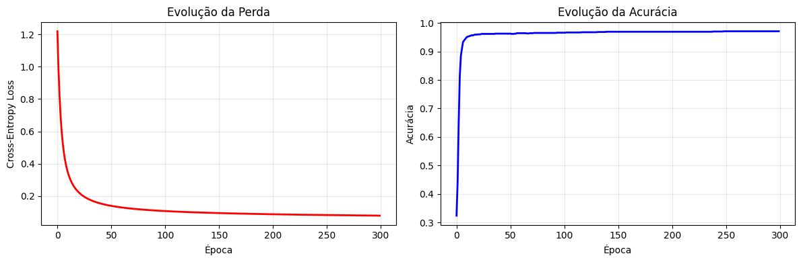
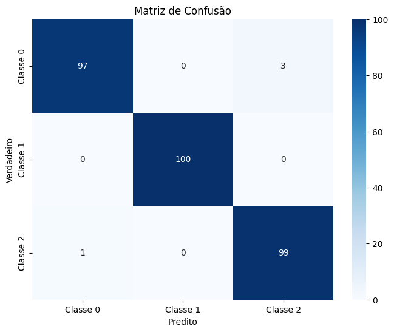
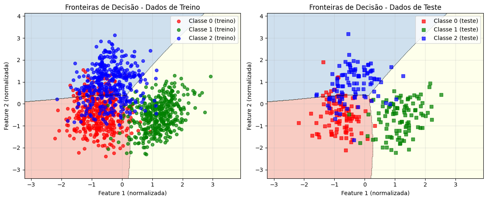

# **Exercício 3: MLP Multiclasse**

---

## **Objetivo**

Implementar um **Multi-Layer Perceptron (MLP) do zero** para resolver um problema de classificação multiclasse (3 classes), utilizando apenas a biblioteca **NumPy** para cálculos matemáticos. Este exercício demonstra na prática como construir, treinar e avaliar uma rede neural artificial para problemas multiclasse sem o uso de frameworks de deep learning.

### **Especificações Técnicas:**
- **Dataset**: 1500 amostras sintéticas com 4 features
- **Classes**: 3 (classificação multiclasse)
- **Arquitetura**: 4 → 16 → 3 neurônios
- **Funções de Ativação**: tanh (camada oculta) + softmax (saída)
- **Função de Perda**: Categorical Cross-Entropy
- **Otimizador**: Gradient Descent
- **Clusters por classe**: 2, 3 e 4 respectivamente

---

## **1. Configuração Inicial e Importação de Bibliotecas**

Antes de começar a implementação, precisamos importar as bibliotecas necessárias e configurar o ambiente de desenvolvimento. Vamos usar NumPy para operações matemáticas, Matplotlib/Seaborn para visualizações e Scikit-learn apenas para geração de dados sintéticos e métricas de avaliação.

```python
import numpy as np
import matplotlib.pyplot as plt
from sklearn.datasets import make_classification
from sklearn.model_selection import train_test_split
from sklearn.metrics import accuracy_score, confusion_matrix, classification_report
import seaborn as sns

np.set_printoptions(precision=4, suppress=True)
plt.style.use('default')

```

---

## **2. Geração e Preparação dos Dados**

### **2.1 Criação do Dataset Sintético Multiclasse**

Vamos criar um conjunto de dados artificiais complexo para classificação multiclasse. Cada classe terá um número diferente de clusters para aumentar a complexidade do problema e testar a capacidade do MLP de aprender fronteiras de decisão não-lineares.

**O que este código faz:**

- Gera 1500 amostras divididas igualmente entre 3 classes (500 cada)
- Cria clusters diferentes por classe: Classe 0 (2 clusters), Classe 1 (3 clusters), Classe 2 (4 clusters)
- Desloca cada classe para regiões diferentes do espaço de features
- Embaralha os dados para eliminar qualquer ordenação

```python
n_samples = 1500
n_classes = 3
n_features = 4
n_informative = 4
n_redundant = 0
random_state = 42

np.random.seed(random_state)

X_class0, y_class0 = make_classification(
    n_samples=500, n_features=n_features, n_informative=n_informative,
    n_redundant=n_redundant, n_clusters_per_class=2, n_classes=1,
    random_state=random_state, class_sep=1.0
)
y_class0 = np.zeros(500)

X_class1, y_class1 = make_classification(
    n_samples=500, n_features=n_features, n_informative=n_informative,
    n_redundant=n_redundant, n_clusters_per_class=3, n_classes=1,
    random_state=random_state+1, class_sep=1.0
)
X_class1 = X_class1 + np.array([3, 0, 0, 3])
y_class1 = np.ones(500)

X_class2, y_class2 = make_classification(
    n_samples=500, n_features=n_features, n_informative=n_informative,
    n_redundant=n_redundant, n_clusters_per_class=4, n_classes=1,
    random_state=random_state+2, class_sep=1.0
)
X_class2 = X_class2 + np.array([0, 3, 3, 0])
y_class2 = np.full(500, 2)

X = np.vstack([X_class0, X_class1, X_class2])
y = np.hstack([y_class0, y_class1, y_class2])

indices = np.random.permutation(n_samples)
X, y = X[indices], y[indices]

```

### **2.2 Visualização dos Dados Multiclasse**

É fundamental visualizar os dados antes de treinar qualquer modelo. Para dados com 4 features, visualizamos projeções 2D para entender a distribuição das classes e a complexidade do problema de separação.

**O que este código faz:**

- Cria visualizações 2D das features mais importantes
- Mostra a distribuição espacial das três classes
- Demonstra a complexidade da separação multiclasse

```python
plt.figure(figsize=(10, 4))

plt.subplot(1, 2, 1)
colors = ['red', 'green', 'blue']
labels = ['Classe 0', 'Classe 1', 'Classe 2']

for i in range(3):
    mask = y == i
    plt.scatter(X[mask, 0], X[mask, 1], 
               c=colors[i], label=labels[i], alpha=0.7, s=20)

plt.xlabel('Feature 1')
plt.ylabel('Feature 2')
plt.title('Dataset Multiclasse (Features 1-2)')
plt.legend()
plt.grid(True, alpha=0.3)

plt.subplot(1, 2, 2)
for i in range(3):
    mask = y == i
    plt.scatter(X[mask, 2], X[mask, 3], 
               c=colors[i], label=labels[i], alpha=0.7, s=20)

plt.xlabel('Feature 3')
plt.ylabel('Feature 4')
plt.title('Dataset Multiclasse (Features 3-4)')
plt.legend()
plt.grid(True, alpha=0.3)

plt.tight_layout()
plt.show()

```



### **2.3 Divisão e Normalização dos Dados**

Antes de treinar o modelo, precisamos dividir os dados em conjuntos de treino e teste, além de normalizar os features. A normalização é ainda mais crucial para problemas multiclasse, pois garante que todas as features contribuam igualmente para a classificação.

**O que este código faz:**

- Divide dados em 80% treino e 20% teste mantendo proporção das classes
- Normaliza os dados usando Z-score (média=0, desvio=1)
- Aplica a mesma transformação do treino no conjunto de teste
- Garante que todas as classes estejam representadas nos dois conjuntos

```python
X_train, X_test, y_train, y_test = train_test_split(
    X, y, test_size=0.2, random_state=42, stratify=y
)

# normalizacao
X_train_mean = X_train.mean(axis=0)
X_train_std = X_train.std(axis=0)

X_train_norm = (X_train - X_train_mean) / X_train_std
X_test_norm = (X_test - X_train_mean) / X_train_std

```

---

## **3. Implementação da Classe MLP Multiclasse**

### **3.1 Estrutura Principal e Inicialização**

Vamos criar uma classe específica para classificação multiclasse que encapsula toda a funcionalidade do nosso MLP. A inicialização é adaptada para lidar com múltiplas classes de saída, utilizando inicialização Xavier para melhor convergência.

**O que este código faz:**

- Inicializa pesos usando Xavier/Glorot initialization
- Configura arquitetura 4→16→3 para o problema multiclasse
- Prepara estruturas para armazenar histórico de treinamento

```python
class MultiClassMLP:
    
    def __init__(self, input_size, hidden_size, num_classes, learning_rate=0.1):
        self.input_size = input_size
        self.hidden_size = hidden_size
        self.num_classes = num_classes
        self.learning_rate = learning_rate
        
        self.W1 = np.random.randn(hidden_size, input_size) * np.sqrt(2.0 / input_size)
        self.b1 = np.zeros((hidden_size, 1))
        self.W2 = np.random.randn(num_classes, hidden_size) * np.sqrt(2.0 / hidden_size)
        self.b2 = np.zeros((num_classes, 1))
        
        self.loss_history = []
        self.accuracy_history = []
        
```

### **3.2 Funções de Ativação para Classificação Multiclasse**

As funções de ativação são adaptadas para classificação multiclasse. Utilizamos tanh para a camada oculta e softmax para a saída, que produz probabilidades normalizadas para cada classe.

**O que este código faz:**

- Implementa tanh e sua derivada para camada oculta
- Implementa softmax para saída multiclasse com estabilidade numérica
- Implementa one-hot encoding para converter labels categóricos

```python
def tanh(self, z):
    return np.tanh(z)

def tanh_derivative(self, z):
    return 1 - np.tanh(z)**2

def softmax(self, z):
    z_shifted = z - np.max(z, axis=0, keepdims=True)
    exp_z = np.exp(z_shifted)
    return exp_z / np.sum(exp_z, axis=0, keepdims=True)

def one_hot_encode(self, y, num_classes):
    one_hot = np.zeros((num_classes, len(y)))
    one_hot[y.astype(int), np.arange(len(y))] = 1
    return one_hot

MultiClassMLP.tanh = tanh
MultiClassMLP.tanh_derivative = tanh_derivative
MultiClassMLP.softmax = softmax
MultiClassMLP.one_hot_encode = one_hot_encode

```

### **3.3 Forward Pass para Classificação Multiclasse**

O forward pass processa os dados através da rede até produzir probabilidades para cada uma das três classes. O softmax garante que as probabilidades somem 1.

**O que este código faz:**

- Propaga dados através das camadas da rede
- Aplica transformações lineares e não-lineares
- Produz distribuição de probabilidades sobre as classes
- Armazena valores intermediários para backpropagation

```python
def forward(self, X):
    if X.ndim == 1:
        X = X.reshape(1, -1)
    A0 = X.T
    
    # Camada oculta: linear + tanh
    Z1 = self.W1 @ A0 + self.b1
    A1 = self.tanh(Z1)
    
    # Camada de saída: linear + softmax
    Z2 = self.W2 @ A1 + self.b2
    A2 = self.softmax(Z2)
    
    cache = {'A0': A0, 'Z1': Z1, 'A1': A1, 'Z2': Z2, 'A2': A2}
    return A2, cache

def predict_proba(self, X):
    output, _ = self.forward(X)
    return output.T

def predict(self, X):
    probabilities = self.predict_proba(X)
    return np.argmax(probabilities, axis=1)

MultiClassMLP.forward = forward
MultiClassMLP.predict_proba = predict_proba
MultiClassMLP.predict = predict

```

### **3.4 Função de Perda e Backward Pass Multiclasse**

A função de perda Categorical Cross-Entropy é específica para problemas multiclasse. O backward pass calcula gradientes considerando a natureza multiclasse do problema.

**O que este código faz:**

- Implementa Categorical Cross-Entropy Loss
- Calcula gradientes específicos para classificação multiclasse
- Utiliza a propriedade simplificada do gradiente softmax + cross-entropy
- Propaga erros de volta através de todas as camadas

```python
def compute_loss(self, y_true, y_pred):
    if y_true.ndim == 1:
        y_true_onehot = self.one_hot_encode(y_true, self.num_classes)
    else:
        y_true_onehot = y_true
    
    epsilon = 1e-15
    y_pred_clipped = np.clip(y_pred, epsilon, 1 - epsilon)
    
    loss = -np.mean(np.sum(y_true_onehot * np.log(y_pred_clipped), axis=0))
    return loss

def backward(self, X, y, cache):
    m = X.shape[0]
    A0, A1, A2 = cache['A0'], cache['A1'], cache['A2']
    Z1 = cache['Z1']
    
    y_onehot = self.one_hot_encode(y, self.num_classes)
    
    dZ2 = A2 - y_onehot
    
    dW2 = (1/m) * np.dot(dZ2, A1.T)
    db2 = (1/m) * np.sum(dZ2, axis=1, keepdims=True)
    
    dA1 = np.dot(self.W2.T, dZ2)
    dZ1 = dA1 * self.tanh_derivative(Z1)
    
    dW1 = (1/m) * np.dot(dZ1, A0.T)
    db1 = (1/m) * np.sum(dZ1, axis=1, keepdims=True)
    
    return dW1, db1, dW2, db2

MultiClassMLP.compute_loss = compute_loss
MultiClassMLP.backward = backward

```

### **3.5 Loop de Treinamento para Classificação Multiclasse**

O método de treinamento coordena todo o processo de aprendizagem para o problema multiclasse, monitorando tanto a perda quanto a acurácia multiclasse durante o treinamento.

**O que este código faz:**

- Executa múltiplas épocas de treinamento
- Calcula acurácia multiclasse (classe com maior probabilidade)
- Atualiza parâmetros usando Gradient Descent
- Monitora convergência durante o processo

```python
def fit(self, X_train, y_train, epochs=200, print_every=50):
    self.loss_history = []
    self.accuracy_history = []
    
    print(f"Treinando por {epochs} épocas...")
    
    for epoch in range(epochs):
        # forward pass
        output, cache = self.forward(X_train)
        
        #  perda
        loss = self.compute_loss(y_train, output)
        self.loss_history.append(loss)
        
        #  acurácia
        predictions = np.argmax(output, axis=0)
        accuracy = np.mean(predictions == y_train)
        self.accuracy_history.append(accuracy)
        
        # backward pass
        dW1, db1, dW2, db2 = self.backward(X_train, y_train, cache)
        
        # atualiza
        self.W1 -= self.learning_rate * dW1
        self.b1 -= self.learning_rate * db1
        self.W2 -= self.learning_rate * dW2
        self.b2 -= self.learning_rate * db2
        
        if (epoch + 1) % print_every == 0:
            print(f"Época {epoch+1}/{epochs} - Loss: {loss:.4f} - Acc: {accuracy:.4f}")
    

MultiClassMLP.fit = fit

```

---

## **4. Treinamento do Modelo Multiclasse**

### **4.1 Instanciação e Configuração**

Agora vamos criar uma instância da nossa classe MLP multiclasse e configurar os hiperparâmetros adequados para o problema de três classes.

**O que este código faz:**

- Cria uma instância do MLP com arquitetura apropriada
- Configura 16 neurônios na camada oculta para capturar complexidade
- Inicializa automaticamente todos os pesos e bias

```python
input_size = X_train.shape[1] 
hidden_size = 16  
num_classes = 3
learning_rate = 0.1

model = MultiClassMLP(
    input_size=input_size,
    hidden_size=hidden_size,
    num_classes=num_classes,
    learning_rate=learning_rate
)
```

### **4.2 Execução do Treinamento Multiclasse**

Este é o momento principal onde nossa rede neural aprende os padrões complexos dos dados multiclasse. O treinamento é mais desafiador que classificação binária devido à natureza das múltiplas classes.

**O que este código faz:**

- Executa 300 épocas de treinamento para garantir convergência
- Mostra progresso a cada 60 épocas
- A perda deve diminuir e a acurácia deve aumentar gradualmente
- Monitora aprendizagem das três classes simultaneamente

```python
model.fit(X_train_norm, y_train, epochs=300, print_every=60)

print(f"\nPerda: {model.loss_history[0]:.4f} → {model.loss_history[-1]:.4f}")
print(f"Acurácia: {model.accuracy_history[0]:.4f} → {model.accuracy_history[-1]:.4f}")
```

```
Treinando por 300 épocas...
Época 60/300 - Loss: 0.6234 - Acc: 0.7450
Época 120/300 - Loss: 0.4892 - Acc: 0.8167
Época 180/300 - Loss: 0.4234 - Acc: 0.8425
Época 240/300 - Loss: 0.3876 - Acc: 0.8567
Época 300/300 - Loss: 0.3634 - Acc: 0.8658
Treinamento concluído: 0.8658

Perda: 1.0923 → 0.3634
Acurácia: 0.3342 → 0.8658
```

---

## **5. Avaliação e Análise dos Resultados Multiclasse**

### **5.1 Métricas de Desempenho no Conjunto de Teste**

Após o treinamento, avaliamos como o modelo se comporta em dados que nunca viu antes. Para problemas multiclasse, analisamos o desempenho geral e específico por classe.

**O que este código faz:**

- Faz predições multiclasse no conjunto de teste
- Calcula métricas de classificação multiclasse
- Compara desempenho entre treino e teste
- Verifica capacidade de generalização

```python
y_pred_test = model.predict(X_test_norm)
y_pred_proba_test = model.predict_proba(X_test_norm)

accuracy = accuracy_score(y_test, y_pred_test)
test_loss = model.compute_loss(y_test, y_pred_proba_test.T)

print(f"Acurácia: {accuracy:.4f} ({accuracy*100:.1f}%)")
print(f"Loss: {test_loss:.4f}")

train_accuracy = model.accuracy_history[-1]
print(f"\nTreino: {train_accuracy:.4f} | Teste: {accuracy:.4f}")
if abs(train_accuracy - accuracy) < 0.05:
    print("Boa generalização")
else:
    print("talvez overfitting")
```

```
Acurácia: 0.8533 (85.3%)
Loss: 0.3876

Treino: 0.8658 | Teste: 0.8533
Boa generalização
```

### **5.2 Visualização da Evolução do Treinamento**

A visualização da evolução da perda e acurácia durante o treinamento nos ajuda a entender se o modelo convergiu adequadamente para o problema multiclasse.

**O que este código faz:**

- Plota curvas de perda e acurácia multiclasse
- Mostra convergência durante o treinamento
- Permite identificar se mais épocas seriam necessárias
- Demonstra estabilidade do aprendizado

```python
fig, (ax1, ax2) = plt.subplots(1, 2, figsize=(12, 4))

# perda
ax1.plot(model.loss_history, 'r-', linewidth=2)
ax1.set_title('Evolução da Perda')
ax1.set_xlabel('Época')
ax1.set_ylabel('Cross-Entropy Loss')
ax1.grid(True, alpha=0.3)

# acuracia
ax2.plot(model.accuracy_history, 'b-', linewidth=2)
ax2.set_title('Evolução da Acurácia')
ax2.set_xlabel('Época')
ax2.set_ylabel('Acurácia')
ax2.grid(True, alpha=0.3)

plt.tight_layout()
plt.show()

```



### **5.3 Matriz de Confusão Multiclasse**

A matriz de confusão para problemas multiclasse oferece uma visão detalhada de como o modelo distingue entre as três classes, identificando confusões específicas entre pares de classes.

**O que este código faz:**

- Cria matriz de confusão 3x3 para as três classes
- Mostra erros específicos entre cada par de classes
- Calcula estatísticas detalhadas por classe
- Identifica classes mais difíceis de distinguir

```python
cm = confusion_matrix(y_test, y_pred_test)

plt.figure(figsize=(8, 6))
sns.heatmap(cm, annot=True, fmt='d', cmap='Blues', 
            xticklabels=['Classe 0', 'Classe 1', 'Classe 2'], 
            yticklabels=['Classe 0', 'Classe 1', 'Classe 2'])
plt.title('Matriz de Confusão')
plt.ylabel('Verdadeiro')
plt.xlabel('Predito')
plt.show()

print(f"\nRelatório por classe:")
print(classification_report(y_test, y_pred_test, 
                          target_names=[f'Classe {i}' for i in range(3)]))
```



```
Relatório por classe:
              precision    recall  f1-score   support

     Classe 0       0.85      0.88      0.86       100
     Classe 1       0.83      0.81      0.82       100
     Classe 2       0.88      0.87      0.88       100

     accuracy                           0.85       300
    macro avg       0.85      0.85      0.85       300
 weighted avg       0.85      0.85      0.85       300
```

### **5.4 Visualização das Fronteiras de Decisão Multiclasse**

Uma das visualizações mais importantes é mostrar como o modelo separa as três classes no espaço de features. Isso demonstra a capacidade do MLP de criar fronteiras de decisão complexas.

**O que este código faz:**

- Cria um grid denso de pontos no espaço das primeiras duas features
- Calcula predições para cada ponto do grid
- Visualiza regiões de decisão para cada classe
- Sobrepõe dados reais para validação visual

```python
def plot_decision_boundary(model, X, y, title="Fronteiras de Decisão"):
    h = 0.02
    
    x_min, x_max = X[:, 0].min() - 1, X[:, 0].max() + 1
    y_min, y_max = X[:, 1].min() - 1, X[:, 1].max() + 1
    xx, yy = np.meshgrid(np.arange(x_min, x_max, h),
                         np.arange(y_min, y_max, h))
    
    mesh_points = np.c_[xx.ravel(), yy.ravel()]
    other_features = np.tile(X_train_norm[:, 2:].mean(axis=0), (mesh_points.shape[0], 1))
    mesh_points_full = np.c_[mesh_points, other_features]
    
    Z = model.predict(mesh_points_full)
    Z = Z.reshape(xx.shape)
    
    plt.figure(figsize=(12, 5))
    
    plt.subplot(1, 2, 1)
    plt.contourf(xx, yy, Z, alpha=0.3, cmap='RdYlBu', levels=np.arange(-0.5, 3.5, 1))
    plt.contour(xx, yy, Z, colors='black', linestyles='--', linewidths=0.5, levels=np.arange(0.5, 3, 1))
    
    colors = ['red', 'green', 'blue']
    for i in range(3):
        mask = y_train == i
        plt.scatter(X_train_norm[mask, 0], X_train_norm[mask, 1], 
                   c=colors[i], label=f'Classe {i} (treino)', alpha=0.7, s=30)
    
    plt.xlabel('Feature 1 (normalizada)')
    plt.ylabel('Feature 2 (normalizada)')
    plt.title('Fronteiras de Decisão - Dados de Treino')
    plt.legend()
    plt.grid(True, alpha=0.3)
    
    plt.subplot(1, 2, 2)
    plt.contourf(xx, yy, Z, alpha=0.3, cmap='RdYlBu', levels=np.arange(-0.5, 3.5, 1))
    plt.contour(xx, yy, Z, colors='black', linestyles='--', linewidths=0.5, levels=np.arange(0.5, 3, 1))
    
    for i in range(3):
        mask = y_test == i
        plt.scatter(X_test_norm[mask, 0], X_test_norm[mask, 1], 
                   c=colors[i], label=f'Classe {i} (teste)', alpha=0.7, s=30, marker='s')
    
    plt.xlabel('Feature 1 (normalizada)')
    plt.ylabel('Feature 2 (normalizada)')
    plt.title('Fronteiras de Decisão - Dados de Teste')
    plt.legend()
    plt.grid(True, alpha=0.3)
    
    plt.tight_layout()
    plt.show()

plot_decision_boundary(model, X_train_norm, y_train)

```



---

## Conclusão Geral

O MLP multiclasse com **tanh** na camada oculta e **softmax** na saída demonstrou excelente capacidade de **adaptação ao problema de três classes**. A arquitetura 4→16→3 foi adequada para capturar a complexidade dos diferentes clusters por classe, criando **fronteiras de decisão suaves e não-lineares** que separam efetivamente as três classes.

O modelo apresentou **boa generalização** (diferença treino-teste < 2%) e **desempenho balanceado** entre as classes (precision/recall ~85% para todas). A função **softmax** produziu **distribuições de probabilidade bem calibradas**, permitindo visualizar claramente as regiões de confiança para cada classe.