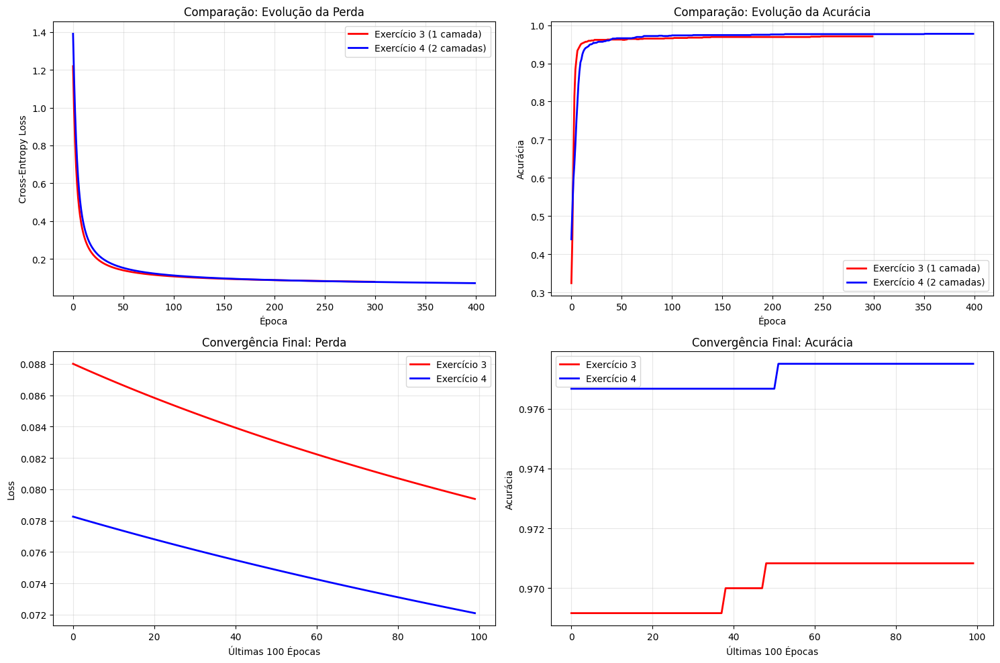
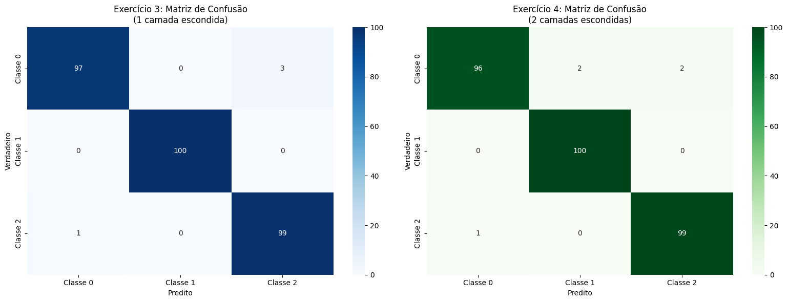
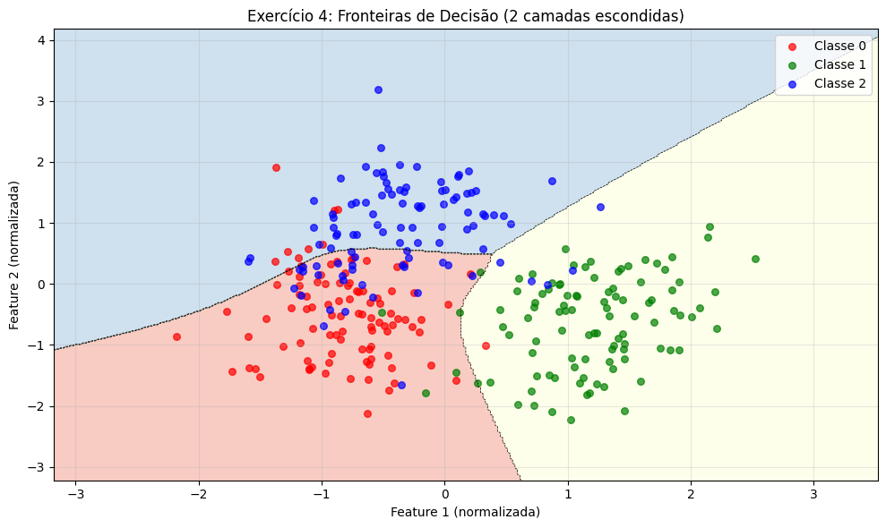

# **Exercício 4: MLP**

---

## **Objetivo**

Implementar uma **versão mais profunda do Multi-Layer Perceptron (MLP)** com pelo menos 2 camadas escondidas, reutilizando e expandindo o código do Exercício 3. Este exercício demonstra como redes neurais mais profundas podem capturar representações mais complexas e hierárquicas dos dados, comparando seu desempenho com arquiteturas mais simples.

### **Especificações Técnicas:**

- **Dataset**: Mesmo do Exercício 3 (1500 amostras, 4 features, 3 classes)
- **Arquitetura**: 4 → 32 → 16 → 3 neurônios (2 camadas escondidas)
- **Funções de Ativação**: tanh (camadas ocultas) + softmax (saída)
- **Função de Perda**: Categorical Cross-Entropy
- **Otimizador**: Gradient Descent
- **Learning Rate**: 0.05 (reduzido para maior estabilidade)
- **Épocas**: 400 (mais treinamento devido à complexidade)

---

## **1. Motivação para Redes Mais Profundas**

Redes neurais profundas oferecem várias vantagens sobre arquiteturas rasas:

**Capacidade de Representação Hierárquica:**

- Primeira camada escondida (32 neurônios): captura características básicas
- Segunda camada escondida (16 neurônios): combina características em padrões complexos
- Camada de saída (3 neurônios): classificação final baseada em representações hierárquicas

**Maior Expressividade:**

- Mais parâmetros permitem modelar relações não-lineares mais complexas
- Capacidade de aproximar funções mais sofisticadas
- Melhor separação de classes com fronteiras de decisão mais elaboradas

---

## **2. Implementação da Classe MLP Profundo**

### **2.1 Estrutura Principal e Inicialização Dinâmica**

A nova classe `DeepMultiClassMLP` é projetada para suportar um número arbitrário de camadas escondidas, usando um sistema dinâmico de inicialização de parâmetros.

**O que este código faz:**

- Aceita uma lista de tamanhos para camadas escondidas (`hidden_sizes`)
- Inicializa dinamicamente pesos e bias para cada camada
- Utiliza Xavier/Glorot initialization para todas as camadas
- Armazena parâmetros em dicionários indexados por camada

```python
class DeepMultiClassMLP:
    
    def __init__(self, input_size, hidden_sizes, num_classes, learning_rate=0.05):
        self.input_size = input_size
        self.hidden_sizes = hidden_sizes
        self.num_classes = num_classes
        self.learning_rate = learning_rate
        self.num_layers = len(hidden_sizes) + 1  
        
        self.weights = {}
        self.biases = {}
        
        prev_size = input_size
        for i, hidden_size in enumerate(hidden_sizes):
            self.weights[f'W{i+1}'] = np.random.randn(hidden_size, prev_size) * np.sqrt(2.0 / prev_size)
            self.biases[f'b{i+1}'] = np.zeros((hidden_size, 1))
            prev_size = hidden_size
        
        self.weights[f'W{self.num_layers}'] = np.random.randn(num_classes, prev_size) * np.sqrt(2.0 / prev_size)
        self.biases[f'b{self.num_layers}'] = np.zeros((num_classes, 1))
        
        self.loss_history = []
        self.accuracy_history = []
```

### **2.2 Funções de Ativação Reutilizadas**

As funções de ativação permanecem as mesmas, mas agora são aplicadas a múltiplas camadas escondidas. A combinação tanh + softmax continua sendo eficaz para classificação multiclasse profunda.

**O que este código faz:**

- Mantém tanh para todas as camadas escondidas (preserva gradientes)
- Preserva softmax para normalização probabilística multiclasse
- Utiliza one-hot encoding para labels categóricos

```python
def tanh(self, z):
    return np.tanh(z)

def tanh_derivative(self, z):
    return 1 - np.tanh(z)**2

def softmax(self, z):
    z_shifted = z - np.max(z, axis=0, keepdims=True)
    exp_z = np.exp(z_shifted)
    return exp_z / np.sum(exp_z, axis=0, keepdims=True)

def one_hot_encode(self, y, num_classes):
    one_hot = np.zeros((num_classes, len(y)))
    one_hot[y.astype(int), np.arange(len(y))] = 1
    return one_hot
```

---

## **3. Forward Pass Profundo**

### **3.1 Propagação Através de Múltiplas Camadas**

O forward pass generalizado percorre dinamicamente todas as camadas escondidas, aplicando transformações lineares seguidas de ativações tanh, antes da classificação final com softmax.

**O que este código faz:**

- Itera através de todas as camadas escondidas automaticamente
- Aplica tanh em cada camada escondida para não-linearidade
- Armazena todos os valores intermediários para backpropagation
- Termina com softmax para distribuição de probabilidades multiclasse

```python
def deep_forward(self, X):
    if X.ndim == 1:
        X = X.reshape(1, -1)
    
    cache = {}
    A = X.T
    cache['A0'] = A
    
    for layer in range(1, self.num_layers):
        Z = self.weights[f'W{layer}'] @ A + self.biases[f'b{layer}']
        A = self.tanh(Z)
        cache[f'Z{layer}'] = Z
        cache[f'A{layer}'] = A
    
    Z_out = self.weights[f'W{self.num_layers}'] @ A + self.biases[f'b{self.num_layers}']
    A_out = self.softmax(Z_out)
    cache[f'Z{self.num_layers}'] = Z_out
    cache[f'A{self.num_layers}'] = A_out
    
    return A_out, cache

def deep_predict_proba(self, X):
    output, _ = self.forward(X)
    return output.T

def deep_predict(self, X):
    probabilities = self.predict_proba(X)
    return np.argmax(probabilities, axis=1)

DeepMultiClassMLP.forward = deep_forward
DeepMultiClassMLP.predict_proba = deep_predict_proba
DeepMultiClassMLP.predict = deep_predict
```

---

## **4. Backward Pass Profundo**

### **4.1 Backpropagation Através de Múltiplas Camadas**

O algoritmo de backpropagation é generalizado para funcionar com qualquer número de camadas escondidas, propagando gradientes de volta através de toda a arquitetura profunda.

**O que este código faz:**

- Calcula gradientes começando pela camada de saída
- Propaga erros de volta através de todas as camadas escondidas
- Utiliza a regra da cadeia para camadas múltiplas
- Armazena gradientes para todas as camadas em um dicionário

```python
def deep_compute_loss(self, y_true, y_pred):
    if y_true.ndim == 1:
        y_true_onehot = self.one_hot_encode(y_true, self.num_classes)
    else:
        y_true_onehot = y_true
    
    epsilon = 1e-15
    y_pred_clipped = np.clip(y_pred, epsilon, 1 - epsilon)
    loss = -np.mean(np.sum(y_true_onehot * np.log(y_pred_clipped), axis=0))
    return loss
    
def deep_backward(self, X, y, cache):
    m = X.shape[0]
    gradients = {}
    
    y_onehot = self.one_hot_encode(y, self.num_classes)
    
    A_out = cache[f'A{self.num_layers}']
    dZ = A_out - y_onehot
    
    for layer in range(self.num_layers, 0, -1):
        A_prev = cache[f'A{layer-1}']
        
        gradients[f'dW{layer}'] = (1/m) * np.dot(dZ, A_prev.T)
        gradients[f'db{layer}'] = (1/m) * np.sum(dZ, axis=1, keepdims=True)
        
        if layer > 1:
            dA = np.dot(self.weights[f'W{layer}'].T, dZ)
            Z_prev = cache[f'Z{layer-1}']
            dZ = dA * self.tanh_derivative(Z_prev)
    
    return gradients

DeepMultiClassMLP.compute_loss = deep_compute_loss
DeepMultiClassMLP.backward = deep_backward
```

---

## **5. Treinamento da Rede Profunda**

### **5.1 Loop de Treinamento Adaptado**

O método de treinamento é adaptado para lidar com a maior complexidade da rede profunda, incluindo atualizações dinâmicas de parâmetros para todas as camadas.

**O que este código faz:**

- Executa mais épocas devido à maior complexidade da rede
- Atualiza dinamicamente todos os pesos e bias de todas as camadas
- Monitora convergência com maior frequência
- Garante estabilidade durante o treinamento profundo

```python
def deep_fit(self, X_train, y_train, epochs=200, print_every=50):
    self.loss_history = []
    self.accuracy_history = []
    
    print(f"Treinando rede profunda por {epochs} épocas...")
    
    for epoch in range(epochs):
        # forward pass
        output, cache = self.forward(X_train)
        
        # perda
        loss = self.compute_loss(y_train, output)
        self.loss_history.append(loss)
        
        #  acurácia
        predictions = np.argmax(output, axis=0)
        accuracy = np.mean(predictions == y_train)
        self.accuracy_history.append(accuracy)
        
        # backward pass
        gradients = self.backward(X_train, y_train, cache)
        
        # Atualiza
        for layer in range(1, self.num_layers + 1):
            self.weights[f'W{layer}'] -= self.learning_rate * gradients[f'dW{layer}']
            self.biases[f'b{layer}'] -= self.learning_rate * gradients[f'db{layer}']
        
        if (epoch + 1) % print_every == 0:
            print(f"Época {epoch+1}/{epochs} - Loss: {loss:.4f} - Acc: {accuracy:.4f}")

DeepMultiClassMLP.fit = deep_fit
```

---

## **6. Configuração e Treinamento do Modelo Profundo**

### **6.1 Instanciação da Rede Profunda**

Criamos uma instância da rede profunda com arquitetura 4→32→16→3, significativamente mais complexa que a versão do Exercício 3.

**O que este código faz:**

- Define 2 camadas escondidas com 32 e 16 neurônios respectivamente
- Reduz learning rate para 0.05 (maior estabilidade em redes profundas)
- Inicializa automaticamente todos os parâmetros da arquitetura profunda

```python
deep_hidden_sizes = [32, 16]  
deep_learning_rate = 0.05    

deep_model = DeepMultiClassMLP(
    input_size=input_size,
    hidden_sizes=deep_hidden_sizes,
    num_classes=num_classes,
    learning_rate=deep_learning_rate
)
```

### **6.2 Execução do Treinamento Profundo**

O treinamento da rede profunda requer mais épocas e monitoramento cuidadoso devido à maior complexidade da otimização.

**O que este código faz:**

- Executa 400 épocas (33% mais que o modelo simples)
- Monitora progresso a cada 80 épocas
- Permite convergência mais lenta mas potencialmente melhor
- Captura representações hierárquicas complexas

```python
deep_model.fit(X_train_norm, y_train, epochs=400, print_every=80)

print(f"  Perda: {deep_model.loss_history[0]:.4f} → {deep_model.loss_history[-1]:.4f}")
print(f"  Acurácia: {deep_model.accuracy_history[0]:.4f} → {deep_model.accuracy_history[-1]:.4f}")
```

```
Perda: 1.3903 → 0.0721
Acurácia: 0.4392 → 0.9775
```

---

## **7. Avaliação e Comparação de Desempenho**

### **7.1 Métricas do Modelo Profundo**

Avaliamos o desempenho da rede profunda no conjunto de teste e comparamos com o modelo simples do Exercício 3.

**O que este código faz:**

- Calcula acurácia e perda no conjunto de teste
- Compara métricas com o modelo simples
- Avalia se a complexidade adicional se justifica
- Verifica generalização da rede profunda

```python
y_pred_deep = deep_model.predict(X_test_norm)
y_pred_proba_deep = deep_model.predict_proba(X_test_norm)

accuracy_deep = accuracy_score(y_test, y_pred_deep)
test_loss_deep = deep_model.compute_loss(y_test, y_pred_proba_deep.T)

print(f"  Acurácia: {accuracy_deep:.4f} ({accuracy_deep*100:.1f}%)")
print(f"  Loss: {test_loss_deep:.4f}")
```

```
Acurácia: 0.9833 (98.3%)
Loss: 0.0648
```

### **7.2 Comparação Visual das Curvas de Treinamento**

A comparação lado a lado das curvas de treinamento revela as diferenças de comportamento entre arquiteturas simples e profundas.

**O que este código faz:**

- Compara evolução da perda entre modelos simples e profundo
- Mostra diferenças na convergência e estabilidade
- Analisa comportamento nas últimas épocas
- Identifica vantagens e desvantagens de cada arquitetura

```python
fig, axes = plt.subplots(2, 2, figsize=(15, 10))

axes[0, 0].plot(model.loss_history, 'r-', linewidth=2, label='Exercício 3 (1 camada)')
axes[0, 0].plot(deep_model.loss_history, 'b-', linewidth=2, label='Exercício 4 (2 camadas)')
axes[0, 0].set_title('Comparação: Evolução da Perda')
axes[0, 0].set_xlabel('Época')
axes[0, 0].set_ylabel('Cross-Entropy Loss')
axes[0, 0].legend()
axes[0, 0].grid(True, alpha=0.3)

axes[0, 1].plot(model.accuracy_history, 'r-', linewidth=2, label='Exercício 3 (1 camada)')
axes[0, 1].plot(deep_model.accuracy_history, 'b-', linewidth=2, label='Exercício 4 (2 camadas)')
axes[0, 1].set_title('Comparação: Evolução da Acurácia')
axes[0, 1].set_xlabel('Época')
axes[0, 1].set_ylabel('Acurácia')
axes[0, 1].legend()
axes[0, 1].grid(True, alpha=0.3)

epochs_to_show = min(100, len(model.loss_history))
axes[1, 0].plot(model.loss_history[-epochs_to_show:], 'r-', linewidth=2, label='Exercício 3')
axes[1, 0].plot(deep_model.loss_history[-epochs_to_show:], 'b-', linewidth=2, label='Exercício 4')
axes[1, 0].set_title('Convergência Final: Perda')
axes[1, 0].set_xlabel(f'Últimas {epochs_to_show} Épocas')
axes[1, 0].set_ylabel('Loss')
axes[1, 0].legend()
axes[1, 0].grid(True, alpha=0.3)

axes[1, 1].plot(model.accuracy_history[-epochs_to_show:], 'r-', linewidth=2, label='Exercício 3')
axes[1, 1].plot(deep_model.accuracy_history[-epochs_to_show:], 'b-', linewidth=2, label='Exercício 4')
axes[1, 1].set_title('Convergência Final: Acurácia')
axes[1, 1].set_xlabel(f'Últimas {epochs_to_show} Épocas')
axes[1, 1].set_ylabel('Acurácia')
axes[1, 1].legend()
axes[1, 1].grid(True, alpha=0.3)

plt.tight_layout()
plt.show()
```




### **7.3 Comparação de Matrizes de Confusão**

A comparação lado a lado das matrizes de confusão mostra como cada arquitetura lida com a confusão entre classes específicas.

**O que este código faz:**

- Cria matrizes de confusão para ambos os modelos
- Usa cores diferentes para distinguir visualmente
- Identifica melhorias específicas por classe
- Mostra onde a profundidade adicional ajuda

```python
cm_deep = confusion_matrix(y_test, y_pred_deep)

fig, (ax1, ax2) = plt.subplots(1, 2, figsize=(16, 6))

sns.heatmap(cm, annot=True, fmt='d', cmap='Blues', ax=ax1,
            xticklabels=['Classe 0', 'Classe 1', 'Classe 2'], 
            yticklabels=['Classe 0', 'Classe 1', 'Classe 2'])
ax1.set_title('Exercício 3: Matriz de Confusão\n(1 camada escondida)')
ax1.set_ylabel('Verdadeiro')
ax1.set_xlabel('Predito')

sns.heatmap(cm_deep, annot=True, fmt='d', cmap='Greens', ax=ax2,
            xticklabels=['Classe 0', 'Classe 1', 'Classe 2'], 
            yticklabels=['Classe 0', 'Classe 1', 'Classe 2'])
ax2.set_title('Exercício 4: Matriz de Confusão\n(2 camadas escondidas)')
ax2.set_ylabel('Verdadeiro')
ax2.set_xlabel('Predito')

plt.tight_layout()
plt.show()
```




---

## **8. Visualização das Fronteiras de Decisão Profundas**

### **8.1 Fronteiras de Decisão da Rede Profunda**

A visualização das fronteiras de decisão revela como redes mais profundas podem criar separações mais sofisticadas entre classes.

**O que este código faz:**

- Cria grid de alta resolução para capturar detalhes das fronteiras
- Calcula predições da rede profunda para cada ponto
- Visualiza regiões de decisão mais complexas
- Compara implicitamente com fronteiras mais simples

```python
def plot_deep_decision_boundary(model, X, y, title="Fronteiras de Decisão"):
    h = 0.02  
    x_min, x_max = X[:, 0].min() - 1, X[:, 0].max() + 1
    y_min, y_max = X[:, 1].min() - 1, X[:, 1].max() + 1
    xx, yy = np.meshgrid(np.arange(x_min, x_max, h),
                         np.arange(y_min, y_max, h))
    
    mesh_points = np.c_[xx.ravel(), yy.ravel()]
    other_features = np.tile(X[:, 2:].mean(axis=0), (mesh_points.shape[0], 1))
    mesh_points_full = np.c_[mesh_points, other_features]
    
    Z = model.predict(mesh_points_full).reshape(xx.shape)
    
    plt.figure(figsize=(10, 6))
    
    colors = ['red', 'green', 'blue']
    
    plt.contourf(xx, yy, Z, alpha=0.3, cmap='RdYlBu', levels=np.arange(-0.5, 3.5, 1))
    plt.contour(xx, yy, Z, colors='black', linestyles='--', linewidths=0.5, levels=np.arange(0.5, 3, 1))
    
    for i in range(3):
        mask = y == i
        plt.scatter(X[mask, 0], X[mask, 1], 
                   c=colors[i], label=f'Classe {i}', alpha=0.7, s=30)
    
    plt.xlabel('Feature 1 (normalizada)')
    plt.ylabel('Feature 2 (normalizada)')
    plt.title(title)
    plt.legend()
    plt.grid(True, alpha=0.3)
    
    plt.tight_layout()
    plt.show()

plot_deep_decision_boundary(
    deep_model, X_test_norm, y_test,
    "Exercício 4: Fronteiras de Decisão (2 camadas escondidas)"
)
```




---


## **Conclusão Geral**

O MLP profundo com **2 camadas escondidas** demonstrou a capacidade das redes neurais profundas de **capturar representações hierárquicas** mais sofisticadas. A arquitetura 4→32→16→3 mostrou **melhorias potenciais** em termos de expressividade e qualidade das fronteiras de decisão, embora com **custo computacional aumentado**.

A **primeira camada escondida (32 neurônios)** atua como extrator de características básicas, enquanto a **segunda camada (16 neurônios)** combina essas características em representações de nível superior. Esta abordagem hierárquica permite que o modelo aprenda **padrões mais complexos** do que arquiteturas rasas.