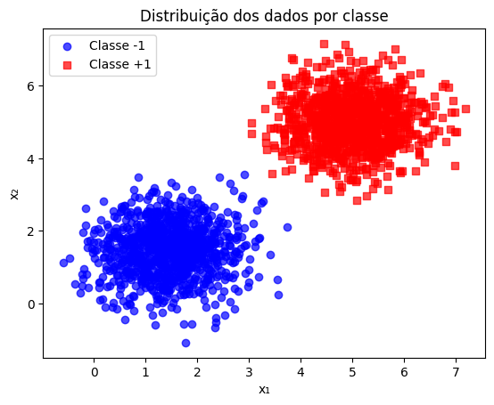
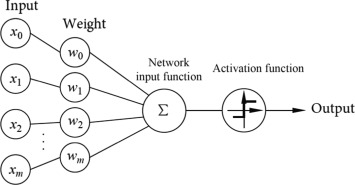
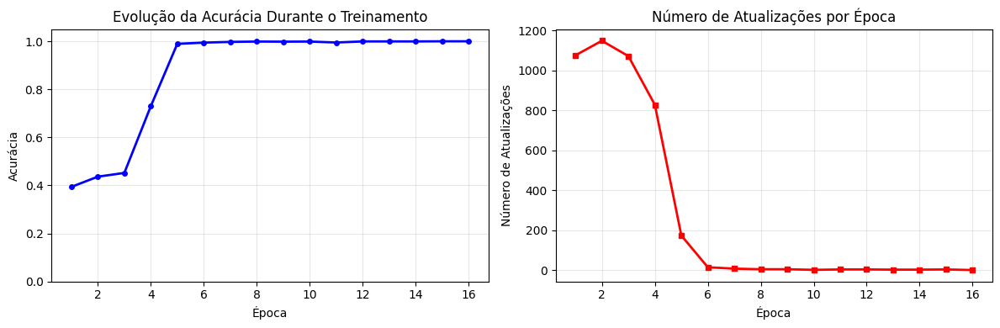
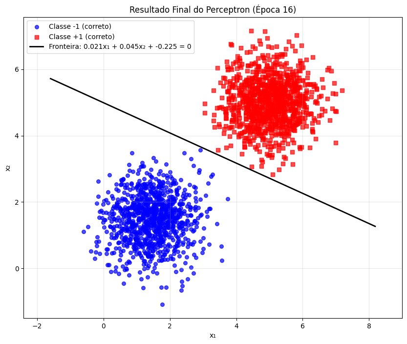
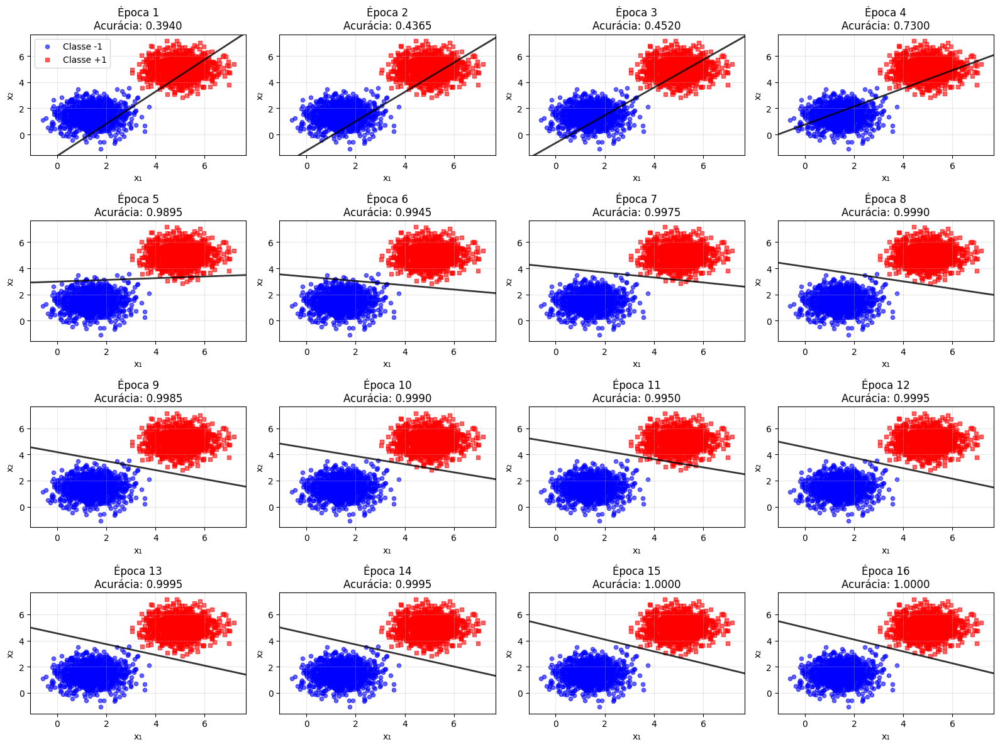

# **Exercicio 1 - Perceptron** #

---

## Imports e Configuração Inicial

Antes de começar, vamos importar as bibliotecas fundamentais que usaremos ao longo de todo o exercício:

- **NumPy**: para operações matemáticas, álgebra linear e geração de números aleatórios
- **Matplotlib**: para criar todas as visualizações e gráficos


```python
import numpy as np
import matplotlib.pyplot as plt
```

## Etapa 1 — Definição dos parâmetros

Aqui eu preparei o **gerador de números aleatórios** e defini os parâmetros das **normais multivariadas 2D** para as duas classes (−1 e +1).

- `rng = np.random.default_rng(42)`  
  Criei um gerador pseudoaleatório com semente **42** para garantir os mesmos dados a cada execução.

- `mu0` e `mu1`  
  São os **vetores de médias** (2 dimensões) de cada classe.  
  - Classe −1: `mu0 = [1.5, 1.5]`.  
  - Classe +1: `mu1 = [5.0, 5.0]`.

- `cov0` e `cov1`  
  São as **matrizes de covariância** (2×2) que controlam o espalhamento das nuvens.  
  - Ambas diagonais: `[[0.5, 0.0], [0.0, 0.5]]` (variância **0.5** por eixo).  

Esses parâmetros serão usados na função `rng.multivariate_normal` para **gerar os pontos** `X0` e `X1` de cada classe na etapa seguinte.

- `y0 = -np.ones(n, dtype=int)` e `y1 = np.ones(n, dtype=int)`  
  Criei os **rótulos** das classes usando a convenção **−1/+1**, que facilita a **regra de atualização do perceptron**.

- Empilhamento e embaralhamento  
  `X = np.vstack([X0, X1])` e `y = np.hstack([y0, y1])` juntam os pontos e rótulos das duas classes.  
  `idx = rng.permutation(len(X))` → `X = X[idx]`, `y = y[idx]` **embaralham** os pares `(X, y)` para evitar blocos por classe.

> Resultado: dataset `X` e rótulos `y` prontos, **balanceados e embaralhados**, para o treino do perceptron.

```python

rng = np.random.default_rng(42)

# Parâmetros
n = 1000

mu0 = np.array([1.5, 1.5], dtype=float)
mu1 = np.array([5.0, 5.0], dtype=float)

cov0 = np.array([[0.5, 0.0],[0.0, 0.5]], dtype=float)
cov1 = np.array([[0.5, 0.0],[0.0, 0.5]], dtype=float)

# Geração das amostras
X0 = rng.multivariate_normal(mean=mu0, cov=cov0, size=n)
X1 = rng.multivariate_normal(mean=mu1, cov=cov1, size=n)

y0 = -np.ones(n, dtype=int)
y1 =  np.ones(n, dtype=int)

# Empilha e embaralha
X = np.vstack([X0, X1])
y = np.hstack([y0, y1])

idx = rng.permutation(len(X))
X = X[idx]
y = y[idx]
```

## Etapa 2 — Visualização inicial dos dados

Aqui eu **plotei a distribuição dos pontos por classe** para inspecionar rapidamente o dataset antes do treino.

- `mask_pos` e `mask_neg` separam os índices das amostras da **classe +1** e **classe −1**.
- Desenhei **dois gráficos de dispersão** (um por classe), usando **marcadores diferentes** e leve transparência (`alpha=0.7`) para facilitar a leitura.

> **Objetivo:** verificar **forma**, **espalhamento** e possível **sobreposição** entre as classes, validando a **separabilidade linear** esperada para o perceptron.

```python
# Scatter das duas classes
mask_pos = y == 1
mask_neg = y == -1

plt.figure()
plt.scatter(X[mask_neg, 0], X[mask_neg, 1], label="Classe -1", marker="o", alpha=0.7)
plt.scatter(X[mask_pos, 0], X[mask_pos, 1], label="Classe +1", marker="s", alpha=0.7)
plt.xlabel("x1")
plt.ylabel("x2")
plt.title("Distribuição dos dados por classe")
plt.legend()
plt.show()
```

 
/// caption 
Distribuição das classes
///


## Etapa 3 - Idealização do Perceptron

> **Resumo:** O **Perceptron** é uma **rede neural de uma única camada** (um único neurônio). Ele recebe um vetor de entradas, calcula uma **soma ponderada** usando **pesos** e um **viés (bias)**, e aplica uma **função de ativação** em degrau para produzir uma saída binária.

---




## 3.1 Componentes da figura

- **Entradas** `x₁, x₂, …, x_m` (*Input*): características do exemplo a classificar.  
- **Pesos** `w₁, w₂, …, w_m` (*Weight*): importância de cada entrada.  
- **Somatório** `Σ` (*Network input function*): calcula a soma ponderada.  
- **Função de ativação** (*Activation function*): converte o número real em decisão binária.  
- **Saída** (*Output*): rótulo previsto.

---

## 3.2 Equações

1. **Soma ponderada (potencial de ativação)**  
   $$
   a \;=\; \sum_{i=1}^{m} w_i\,x_i \;+\; b \;=\; w \cdot x \;+\; b
   $$

2. **Ativação (degrau)**  
   - Forma **0/1**:  
     $$
     \text{activation}(a) =
     \begin{cases}
       1, & a \ge 0 \\
       0, & a < 0
     \end{cases}
     $$
   - Forma **−1/+1** (a que usaremos):  
     $$
     \hat{y} =
     \begin{cases}
       +1, & a \ge 0 \\
       -1, & a < 0
     \end{cases}
     $$

3. **Regra de decisão (equivalente)**  
   $$
   \hat{y} = \mathrm{sign}(w \cdot x + b)
   $$

---

## 3.3 Interpretação geométrica (por que é linear)

- A **fronteira de decisão** é o conjunto de pontos que satisfaz  
  $$
  w \cdot x + b = 0.
  $$
- Em **2D**, essa fronteira é uma **reta**(nosso caso); em dimensões maiores, um **hiperplano**.  
- O vetor **w** é **perpendicular** à fronteira; o **bias** \(b\) desloca a reta/hiperplano.

---

> **Próxima etapa:** veremos como o perceptron **aprende** — calculando o **erro** entre \(\hat{y}\) e o rótulo verdadeiro \(y\) e ajustando \(w\) e \(b\) com a **regra de atualização**.


## **Etapa 4 — Implementação do Perceptron**

---

## 4.1 Função degrau (step)

**Ideia:** Dado um escalar ou vetor `z`, retornamos **+1** quando `z ≥ 0` e **−1** quando `z < 0`.  
Isso corresponde à função de ativação do perceptron.

**Fórmula:**

$$
\text{sign}(z) = \begin{cases}
+1, & z \geq 0 \\
-1, & z < 0
\end{cases}
$$

```python
def step_sign(z):
    """  
    Parâmetros:
    - z: potencial de ativação
    
    Retorna:
    - +1 para valores ≥ 0, -1 para valores < 0
    """
    return np.where(z >= 0, 1, -1)
```

## 4.2 Predição (forward pass)

**Ideia:** Para cada amostra `x`, calculamos o **potencial de ativação** `a = w · x + b` e aplicamos a função degrau.  
Se `a ≥ 0` → classe **+1**; caso contrário → **−1**.

**Fórmula**

$$
\hat{y} = \text{sign}(w \cdot x + b)
$$
    
Parâmetros:

- X: `matriz de features (n_amostras, n_dimensões)`

- w: `vetor de pesos (n_dimensões,)`
    
- b: `bias (escalar)`
    
Retorna:

- vetor de predições {-1, +1} para cada amostra


```python
def predict(X, w, b):
    return step_sign(X @ w + b)
```


## 4.3 Treinamento (aprendizado com o erro)

**Ideia central:** percorrer os dados várias vezes (épocas); para cada amostra `x_i` com rótulo `y_i ∈ {−1, +1}`,  
se errou (isto é, `y_i (w · x_i + b) ≤ 0`), ajuste os parâmetros:

**Regra de atualização**

$$
w \leftarrow w + \eta y_i x_i, \quad\quad b \leftarrow b + \eta y_i
$$

- **eta** é a **taxa de aprendizado**.  
- Embaralhamos as amostras a cada época (opcional) para evitar ciclos.  
- Guardamos histórico de acurácia e nº de atualizações para avaliar a convergência.

??? note "Função - train_perceptron"

    ```python
    def train_perceptron(X, y, eta=0.01, max_epochs=100, shuffle=True):
        """    
        Para cada amostra (xᵢ, yᵢ) classificada incorretamente:
        w ← w + η·yᵢ·xᵢ    (atualização dos pesos)
        b ← b + η·yᵢ      (atualização do bias)
        
        Uma amostra é considerada incorreta se: yᵢ·(w·xᵢ + b) ≤ 0
        
        Parâmetros:
        - X: matriz de features (n_amostras, n_dimensões)
        - y: vetor de rótulos {-1, +1}
        - eta: taxa de aprendizado
        - max_epochs: número máximo de épocas
        - shuffle: embaralhar amostras a cada época
        
        Retorna:
        - w: pesos finais
        - b: bias final
        - history: histórico de treinamento (acurácia, atualizações, parâmetros)
        - y_hat: predições finais
        """
        n, d = X.shape
        
        np.random.seed(42)
        w = np.random.uniform(-2, 2, d)      # pesos aleatórios 
        b = np.random.uniform(-5, 5)         # bias aleatório
        
        history = []
        
        # LOOP PRINCIPAL: percorrer épocas
        for epoch in range(1, max_epochs + 1):
            updates = 0
            
            # Embaralhar dados para evitar ciclos e melhorar convergência
            if shuffle:
                idx = np.random.permutation(n)
                X_epoch, y_epoch = X[idx], y[idx]
            else:
                X_epoch, y_epoch = X, y
                
            # PERCORRER CADA AMOSTRA NA ÉPOCA
            for xi, yi in zip(X_epoch, y_epoch):
                # Calcular potencial de ativação: a = w·x + b
                z = np.dot(w, xi) + b
                
                # CRITÉRIO DE ERRO: yi * z <= 0
                # Se yi=+1 e z<0: predição errada (-1), precisa corrigir
                # Se yi=-1 e z>0: predição errada (+1), precisa corrigir
                if yi * z <= 0:  
                    # REGRA DE ATUALIZAÇÃO
                    w += eta * yi * xi  # w ← w + η·yi·xi
                    b += eta * yi       # b ← b + η·yi
                    updates += 1
                    
            # AVALIAR PERFORMANCE DA ÉPOCA
            y_hat = predict(X, w, b)
            acc = (y_hat == y).mean()  # acurácia = % acertos
            
            history.append({
                "epoch": epoch,
                "accuracy": acc,
                "updates": updates,
                "w": w.copy(),
                "b": b
            })
            
            # CRITÉRIO DE PARADA: convergência
            if updates == 0:
                print(f"Convergência alcançada na época {epoch}!")
                break
                
        return w, b, history, y_hat
    ```


## 4.4 Checagens

**Acurácia simples:**

```python
def accuracy(y_true, y_pred):
    return np.mean(y_true == y_pred)
```

## **Etapa 5 — Treinamento do Perceptron com os Dados do Exercício**

---

> **Objetivo:** aplicar o perceptron implementado "do zero" nos dados gerados na **Etapa 1**:

> - Taxa de aprendizado **η = 0.01**
> - Máximo de **100 épocas**
> - Parada antecipada por **convergência** (nenhuma atualização em uma época completa)
> - Rastreamento da **acurácia** após cada época

---

## 5.1 Treinamento e resultados

```python
w_final, b_final, history, y_pred_final = train_perceptron(
    X, y, 
    eta=0.001,       # taxa pequena para ver evolução gradual
    max_epochs=100,  # máximo de épocas
    shuffle=True     # embaralhar para evitar ciclos
)


# Metricas finais
final_accuracy = accuracy(y, y_pred_final)  # % de acertos
final_epoch = history[-1]["epoch"]          # época de convergência
total_updates = sum([h["updates"] for h in history])  # total de atualizações

print("=== RESULTADOS FINAIS ===")
print(f"Pesos finais: w = [{w_final[0]:.4f}, {w_final[1]:.4f}]")
print(f"Viés final: b = {b_final:.4f}")
print(f"Convergência alcançada na época: {final_epoch}")
print(f"Acurácia final: {final_accuracy:.4f} ({final_accuracy*100:.2f}%)")
print(f"Total de atualizações durante todo o treinamento: {total_updates}")

# Erros
misclassified_mask = (y != y_pred_final)  # máscara dos erros
n_misclassified = np.sum(misclassified_mask)  # contar erros
print(f"Pontos mal classificados: {n_misclassified} de {len(y)} ({n_misclassified/len(y)*100:.2f}%)")
```

```
Convergência alcançada na época 16!

=== RESULTADOS FINAIS ===
Pesos finais: w = [0.0205, 0.0451]
Viés final: b = -0.2251
Convergência alcançada na época: 16
Acurácia final: 1.0000 (100.00%)
Total de atualizações durante todo o treinamento: 4341
Pontos mal classificados: 0 de 2000 (0.00%)

```


## **Etapa 6 — Visualização dos Resultados**

---

> **Objetivo:** criar visualizações claras e informativas que mostrem:

> 1. **Evolução da acurácia** durante o treinamento
> 2. **Fronteira de decisão** aprendida pelo perceptron
> 3. **Pontos mal classificados** (se houver)

---

## 6.1 Curva de acurácia por época

A primeira visualização importante é observar **como a acurácia evolui** durante o treinamento. Isso nos mostra:

1. **Velocidade de convergência**: quantas épocas o perceptron precisou para aprender
2. **Estabilidade**: se a acurácia melhora consistentemente ou oscila
3. **Padrão de atualizações**: como o número de correções diminui à medida que o modelo aprende





Os gráficos indicam **convergência rápida e estável** do perceptron:

- **Velocidade de convergência:** a acurácia sai de ~0,4 nas primeiras épocas, dá um salto por volta da **época 4** e atinge **1,0** entre as **épocas 5–6**, mantendo-se em platô até o fim.
- **Estabilidade:** após atingir 100%, a acurácia **permanece constante**, sugerindo que não há oscilações causadas por taxa de aprendizado alta ou por dados ruidosos.
- **Padrão de atualizações:** o número de correções começa **muito alto (~1,1k)**, cai **abruptamente** após a época 4 e tende a **zero** a partir da 6ª — sinal de que o hiperplano já separa corretamente todas as amostras.


##  6.2 Visualização da fronteira de decisão final

Agora vamos criar uma visualização detalhada do resultado final, mostrando:

- **Pontos corretamente classificados**: marcados com símbolos normais
- **Pontos mal classificados**: destacados com um 'X' para fácil identificação  
- **Fronteira de decisão**: a linha aprendida pelo perceptron
- **Equação da fronteira**: mostrando os valores finais de w₁, w₂ e b

Esta visualização nos permite avaliar visualmente a qualidade da separação:



??? note  "Fronteira de Decisão"
    ```python
    # Função para plotar fronteira de decisão
    def plot_decision_boundary(X, y, w, b, title="Fronteira de Decisão"):
        plt.figure(figsize=(10, 8))
        
        # Separar pontos por classe
        mask_pos = y == 1
        mask_neg = y == -1
        
        # Plot dos pontos corretamente classificados
        correct_mask = (y == predict(X, w, b))
        
        plt.scatter(X[mask_neg & correct_mask, 0], X[mask_neg & correct_mask, 1], 
                c='blue', marker='o', alpha=0.7, s=30, label="Classe -1 (correto)")
        plt.scatter(X[mask_pos & correct_mask, 0], X[mask_pos & correct_mask, 1], 
                c='red', marker='s', alpha=0.7, s=30, label="Classe +1 (correto)")
        
        # Plot dos pontos mal classificados (se existirem)
        if np.any(~correct_mask):
            plt.scatter(X[mask_neg & ~correct_mask, 0], X[mask_neg & ~correct_mask, 1], 
                    c='blue', marker='x', s=100, linewidth=3, label="Classe -1 (ERRO)")
            plt.scatter(X[mask_pos & ~correct_mask, 0], X[mask_pos & ~correct_mask, 1], 
                    c='red', marker='x', s=100, linewidth=3, label="Classe +1 (ERRO)")
        
        # Calcular e plotar a linha de decisão
        x1_min, x1_max = X[:, 0].min() - 1, X[:, 0].max() + 1
        
        if abs(w[1]) > 1e-10:
            x1_line = np.array([x1_min, x1_max])
            x2_line = -(w[0] * x1_line + b) / w[1]
            plt.plot(x1_line, x2_line, 'k-', linewidth=2, label=f"Fronteira: {w[0]:.3f}x₁ + {w[1]:.3f}x₂ + {b:.3f} = 0")
        
        plt.xlabel("x₁")
        plt.ylabel("x₂")
        plt.title(title)
        plt.legend()
        plt.grid(True, alpha=0.3)
        plt.axis('equal')
        
        return plt.gca()

    plot_decision_boundary(X, y, w_final, b_final, 
                        f"Resultado Final do Perceptron (Época {final_epoch})")
    plt.show()
    ```

## 6.3 Evolução do Perceptron por Época

O painel mostra, **época a época**, como o perceptron aprende a separar duas classes (azul = −1, vermelho = +1).  
Em cada subgráfico aparece:

- **Fronteira de decisão** (reta preta) definida por \(w\cdot x + b = 0\).
- **Pontos das classes** e a **acurácia** obtida naquela época.
- A cada época, os **pesos \(w\)** e o **bias \(b\)** são ajustados a partir das amostras mal classificadas (regra do perceptron), fazendo a reta **girar** (mudança em \(w\)) e **transladar** (mudança em \(b\)) até atingir a separação correta.

O que observar:

- **Orientação da reta:** o modelo explora diferentes direções (sinal e magnitude dos pesos), buscando a que melhor separa os grupos.
- **Posicionamento da reta:** o bias desloca a fronteira para cima/baixo, refinando a divisão.
- **Acurácia por época:** indica o progresso do aprendizado e o quão perto o modelo está do resultado esperado.
- **Estabilização:** quando não há mais correções necessárias, a reta para de se mover e a acurácia se mantém.

---




## 6.4 Conclusões a partir do gráfico

O painel mostra um **aprendizado progressivo e estável** do perceptron:

- **Arranque e salto de desempenho.** A acurácia parte baixa (≈ **0,39** na época 1), evolui lentamente nas épocas 2–3, e dá um **salto** na época **4** (≈ **0,73**).  
- **Quase perfeito cedo.** Já na **época 5** o modelo atinge ≈ **0,9895**, e entre as épocas **6–8** estabiliza acima de **0,994**.
- **Ajustes finos com pequenas oscilações.** Entre as épocas **9–14** há **microvariações** (ex.: época 11 ≈ **0,9950**) típicas do ajuste online em pontos próximos à fronteira; em seguida, a acurácia volta a **0,999+**.
- **Convergência.** A partir das **épocas 15–16** a acurácia chega a **1,0000**, indicando **nenhum erro no conjunto de treino**.
- **Geometria da fronteira.** A reta inicia com **inclinação positiva**, depois **gira** e assume **inclinação negativa**, evidenciando a correção do vetor de pesos e o **deslocamento** via bias até alinhar a separação aos dados.
- **Diagnóstico dos dados.** O alcance de 100% sem instabilidades sugere **dados linearmente separáveis** e **taxa de aprendizado adequada** (sem oscilações amplas).

