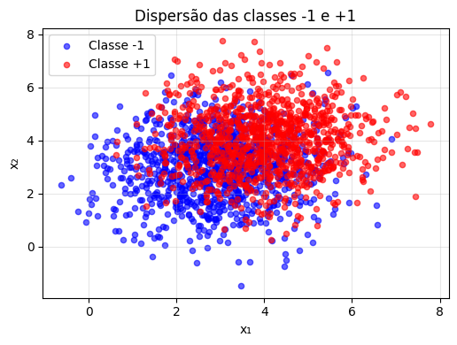
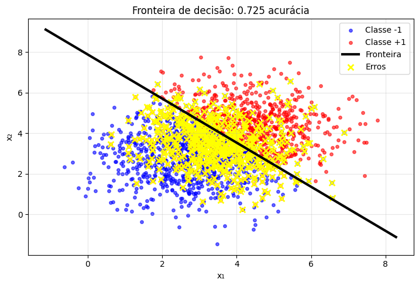

# **Exercício 2 - Perceptron** 


---

O objetivo desse exercicio é mostrar como esse modelo de perceptron age para um dataset muito mais complicado. Além disso, vamos refletir sobre possíveis saidas para esse problema.


## Etapa 1 — Geração do conjunto com *overlap* (dados de treino)

**Objetivo do bloco:** criar duas classes 2D com **médias próximas** e **variância alta** para induzir *overlap* (não separabilidade linear perfeita), já com rótulos em \{-1, +1\} e dados **embaralhados** no final.

**O que o código faz:**

- `rng2 = np.random.default_rng(42)`: fixa a **semente** para reprodutibilidade.
- `n2 = 1000`: define **1.000 amostras por classe** (total = 2.000).
- `mu0_ex2`, `mu1_ex2`: médias das classes **[-1] → [3, 3]** e **[+1] → [4, 4]**.
- `sigma2 = 1.5` e `cov_ex2 = [[1.5, 0], [0, 1.5]]`: **covariância isotrópica** com variância 1.5 em cada eixo.
- `X0_ex2`, `X1_ex2`: amostragem **multivariada normal** de cada classe.
- `y0_ex2 = -1`, `y1_ex2 = +1`: rótulos.
- `X_ex2 = vstack(...)`, `y_ex2 = hstack(...)`: concatena as duas classes em um único conjunto.
- `idx2 = rng2.permutation(...)` e reindexação: **embaralha** as amostras para não ficarem em blocos por classe.

**Saídas esperadas:**

- `X_ex2` com **shape (2000, 2)** e `y_ex2` com **shape (2000,)**.
- Distribuição com *overlap* visível — ideal para avaliar as **limitações do Perceptron** em dados não totalmente separáveis.


```python
rng2 = np.random.default_rng(42)

n2 = 1000 

mu0_ex2 = np.array([3.0, 3.0])  
mu1_ex2 = np.array([4.0, 4.0])

sigma2 = 1.5
cov_ex2 = np.array([[sigma2, 0.0], [0.0, sigma2]])

X0_ex2 = rng2.multivariate_normal(mu0_ex2, cov_ex2, n2)
X1_ex2 = rng2.multivariate_normal(mu1_ex2, cov_ex2, n2)

y0_ex2 = -np.ones(n2, dtype=int)
y1_ex2 = np.ones(n2, dtype=int)

X_ex2 = np.vstack([X0_ex2, X1_ex2])
y_ex2 = np.hstack([y0_ex2, y1_ex2])

idx2 = rng2.permutation(len(X_ex2))
X_ex2 = X_ex2[idx2]
y_ex2 = y_ex2[idx2]
```

## Etapa 2 — Visualização inicial das classes

Vamos plotar um **gráfico de dispersão** (x₁ vs x₂) separando as amostras por classe (−1 em azul, +1 em vermelho).  
Essa visualização serve para:

- **Confirmar o *overlap*** entre as distribuições (as nuvens se interpenetram).
- Ver **forma e dispersão** dos clusters (variância maior, sem correlação entre eixos).
- Antecipar o comportamento do Perceptron: como a separação **não é perfeita**, a fronteira linear deverá resultar em **erros residuais** mesmo após o treino.

> Esta etapa é o “antes do treino”: é nossa **linha de base visual** para comparar depois com a fronteira aprendida.


```python
plt.figure(figsize=(10, 4))

plt.subplot(1, 2, 2)
mask_pos_ex2 = y_ex2 == 1
mask_neg_ex2 = y_ex2 == -1
plt.scatter(X_ex2[mask_neg_ex2, 0], X_ex2[mask_neg_ex2, 1], c='blue', alpha=0.6, s=20, label="Classe -1")
plt.scatter(X_ex2[mask_pos_ex2, 0], X_ex2[mask_pos_ex2, 1], c='red', alpha=0.6, s=20, label="Classe +1")
plt.title("Dispersão das classes -1 e +1")
plt.xlabel("x₁")
plt.ylabel("x₂")
plt.legend()
plt.grid(True, alpha=0.3)

plt.tight_layout()
plt.show()
```



**Análise do scatter**

- As nuvens azul (−1) e vermelha (+1) estão **fortemente sobrepostas** no miolo do plano — coerente com médias próximas **(≈[3,3] e [4,4])** e variância alta **(1.5)**.  
- Há uma tendência da classe +1 ocupar valores um pouco **maiores** de \(x_1\) e \(x_2\), mas sem um “gap” limpo.  
- Consequência prática: um **limite linear** deverá separar “em média” as classes, mas **erros residuais são inevitáveis** — esperamos **acurácia < 100%** e **atualizações persistentes** durante o treino do Perceptron.


## Etapa 3 — Treinamento do Perceptron

Aqui treinamos o modelo **reutilizando exatamente a função `train_perceptron` do Exercício 1** sobre o conjunto com *overlap*:

- `w_ex2, b_ex2, history_ex2, y_pred_ex2 = train_perceptron(X_ex2, y_ex2, eta=0.001, max_epochs=100, shuffle=True)`  
  - **`X_ex2`, `y_ex2`**: dados gerados na etapa anterior.  
  - **`eta=0.001`**: taxa de aprendizado **menor** para estabilizar a aprendizagem em dados não totalmente separáveis.  
  - **`max_epochs=100`**: limite superior de épocas.  
  - **`shuffle=True`**: embaralha as amostras a cada época, o que ajuda a evitar ciclos em cenários com *overlap*.  
  - **Saídas**:  
    - `w_ex2`, `b_ex2`: pesos e viés aprendidos;  
    - `history_ex2`: lista com métricas por época (`accuracy`, `updates`, `w`, `b`);  
    - `y_pred_ex2`: predições finais no treino (\{-1, +1\}).

Em seguida calculamos as métricas:

- `final_acc_ex2 = accuracy(y_ex2, y_pred_ex2)`: **acurácia final** no conjunto de treino (mesma função de utilitário usada no Exercício 1).  
- `final_epoch_ex2 = history_ex2[-1]["epoch"]`: **última época executada** (serve para inferir se bateu o limite de 100).  
- `total_updates_ex2 = sum(h["updates"] for h in history_ex2)`: **total de atualizações** (quantas correções ocorreram ao longo de todo o treinamento).

> Lembrando: como há *overlap*, é esperado que a acurácia **não atinja 100%** e que possamos **não zerar** atualizações antes de chegar a `max_epochs`.

```python
w_ex2, b_ex2, history_ex2, y_pred_ex2 = train_perceptron(
    X_ex2, y_ex2, 
    eta=0.001,      
    max_epochs=100, 
    shuffle=True
)

final_acc_ex2 = accuracy(y_ex2, y_pred_ex2)
final_epoch_ex2 = history_ex2[-1]["epoch"]
total_updates_ex2 = sum([h["updates"] for h in history_ex2])

print("RESULTADOS:")
print(f"   Convergiu? {'NÃO' if final_epoch_ex2 >= 100 else 'SIM'}")
print(f"   Épocas usadas: {final_epoch_ex2}/100")
print(f"   Acurácia final: {final_acc_ex2:.3f} ({final_acc_ex2*100:.1f}%)")
print(f"   Total de atualizações: {total_updates_ex2}")
```

```
RESULTADOS:
   Convergiu? NÃO
   Épocas usadas: 100/100
   Acurácia final: 0.725 (72.5%)
   Total de atualizações: 75725
```

## Etapa 4 — Fronteira de decisão sobre os dados e destaque dos erros

**O que este bloco faz:**

- Reaproveita os **parâmetros aprendidos** no treino (`w_ex2`, `b_ex2`) para **sobrepor a fronteira de decisão** \(w_1x_1 + w_2x_2 + b = 0\) ao *scatter* das classes.

- **Erros de classificação** são realçados com marcadores **‘x’ amarelos**: `errors_ex2 = (y_ex2 != y_pred_ex2)`.  
  Em dados com *overlap*, é esperado ver esses pontos concentrados **próximos à fronteira**, evidenciando a limitação do classificador linear.

**O que observar no resultado:**

- **Inclinação e posição** da reta refletem os pesos \(w\) e o bias \(b\) aprendidos: rotação ⇢ \(w\), deslocamento ⇢ \(b\).
- Em função do *overlap*, haverá **erros residuais** (as marcas amarelas), mesmo após treinamento, e a acurácia **não deve chegar a 100%**.
- A fronteira se posiciona como um **compromisso** entre as duas distribuições, minimizando erros em média.


```python
plt.figure(figsize=(14, 5))


plt.subplot(1, 2, 2)
plt.scatter(X_ex2[mask_neg_ex2, 0], X_ex2[mask_neg_ex2, 1], c='blue', alpha=0.6, s=15, label="Classe -1")
plt.scatter(X_ex2[mask_pos_ex2, 0], X_ex2[mask_pos_ex2, 1], c='red', alpha=0.6, s=15, label="Classe +1")

x1_range_ex2 = np.array([X_ex2[:, 0].min()-0.5, X_ex2[:, 0].max()+0.5])
if abs(w_ex2[1]) > 1e-10:
    x2_line_ex2 = -(w_ex2[0] * x1_range_ex2 + b_ex2) / w_ex2[1]
    plt.plot(x1_range_ex2, x2_line_ex2, 'k-', linewidth=3, label="Fronteira")

# erros
errors_ex2 = (y_ex2 != y_pred_ex2)
if np.any(errors_ex2):
    plt.scatter(X_ex2[errors_ex2, 0], X_ex2[errors_ex2, 1], 
               c='yellow', marker='x', s=50, linewidth=2, label="Erros")

plt.title(f"Fronteira de decisão: {final_acc_ex2:.3f} acurácia")
plt.xlabel("x₁")
plt.ylabel("x₂")
plt.legend()
plt.grid(True, alpha=0.3)

plt.tight_layout()
plt.show()
```



## Etapa 5 — Conclusões sobre os resultados

A fronteira aprendida é **linear** e a acurácia final ficou em **≈ 0,725**. Os **erros (marcados em amarelo)** concentram-se na **região central** onde as duas distribuições se sobrepõem, exatamente onde um limite linear não consegue discriminar perfeitamente.

**Por que chegamos a ~0,72 de acurácia?**
- Os dados foram gerados por **duas gaussianas com médias próximas** \([3,3]\) e \([4,4]\) e **mesma covariância isotrópica** \(\Sigma = 1.5\,I\). Logo, o problema **não é linearmente separável**.
- O Perceptron ter chegado a **0,725** é **coerente** e **próximo do ótimo** para um modelo linear.

**E o MLP?**  
Um **Multi-Layer Perceptron** (com ativações não lineares) pode aprender **fronteiras curvas** e superar modelos lineares **se** a separação ótima for não linear. Neste dataset específico (duas gaussianas com covariâncias iguais), o ótimo é **linear**; portanto, um MLP bem regularizado tende a **empatar** com um linear em média. Ele só superaria de forma consistente **se** a estrutura real dos dados exigir **não linearidade**.

> Resumindo: era **previsto** que uma reta não separasse perfeitamente essas duas classes. Para ganhos reais, use **lineares bem calibrados** ou **modelos não lineares** quando houver evidência de fronteira não linear.
