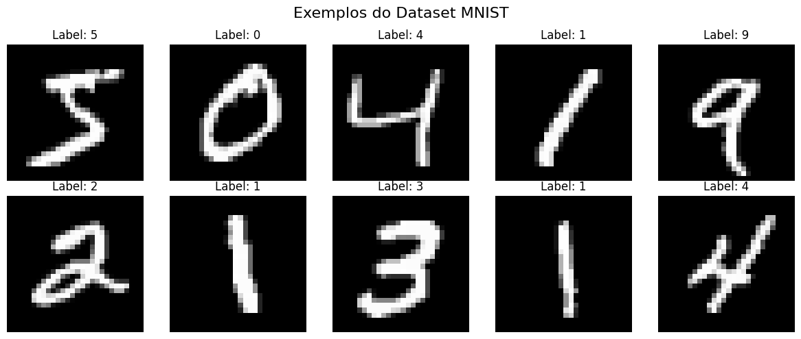
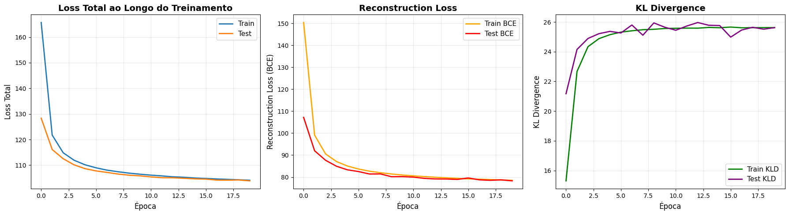
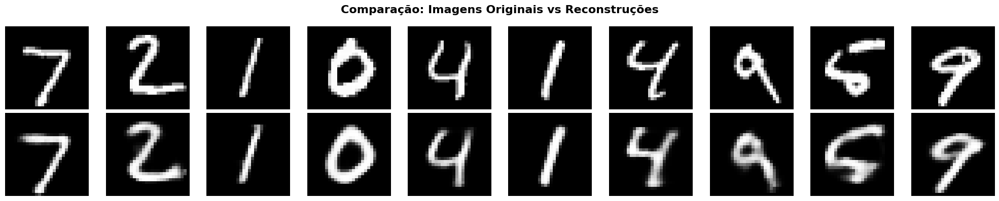
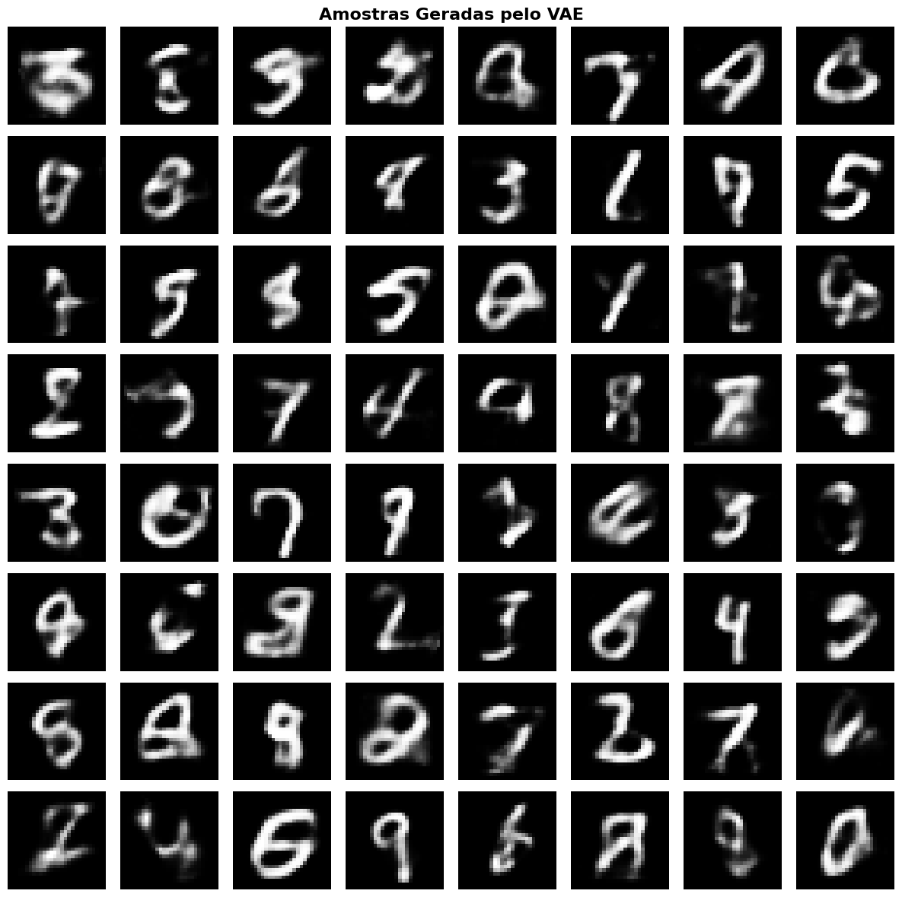
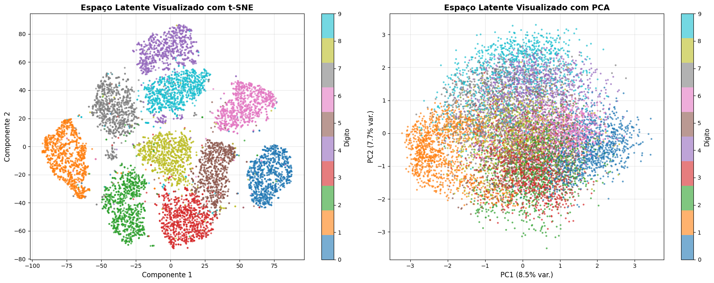

# Exercício 4 - Variational Autoencoder (VAE)

Este relatorio implementa um Variational Autoencoder (VAE) no dataset MNIST para compreender e explorar modelos generativos baseados em aprendizado profundo.

---

## Objetivos:

### Objetivo Geral
Implementar e avaliar um Variational Autoencoder (VAE) no dataset MNIST, compreendendo sua arquitetura, processo de treinamento e capacidades generativas.

### Objetivos Específicos

**Preparação de Dados**
- Carregar e normalizar o dataset MNIST
- Dividir em conjuntos de treino e validação
- Criar DataLoaders para processamento eficiente em batches

**Implementação do Modelo**

   - Definir a arquitetura do VAE (encoder e decoder)
   - Implementar o reparameterization trick
   - Construir a função de loss combinando reconstruction loss e KL divergence

**Treinamento**

   - Treinar o VAE no dataset MNIST
   - Monitorar métricas de loss durante o treinamento
   - Gerar reconstruções periódicas para avaliar progresso

**Avaliação**

   - Avaliar performance no conjunto de validação
   - Gerar novas amostras a partir do espaço latente aprendido
   - Analisar a qualidade das reconstruções

**Visualização**

   - Comparar imagens originais com reconstruções
   - Visualizar o espaço latente usando técnicas de redução de dimensionalidade (t-SNE, PCA)
   - Explorar a organização semântica do espaço latente


---


### 1. Importação das Bibliotecas


```python
import torch
import torch.nn as nn
import torch.nn.functional as F
import torch.optim as optim
from torch.utils.data import DataLoader
from torchvision import datasets, transforms

import numpy as np
import matplotlib.pyplot as plt
from sklearn.manifold import TSNE
from sklearn.decomposition import PCA
import warnings
```

### 2. Preparação dos dados


Nesta seção, realizamos as seguintes operações:

1. Carregamento do dataset MNIST
2. Normalização das imagens para o intervalo [0, 1]
3. Divisão em conjuntos de treino e validação
4. Criação dos DataLoaders para processamento em batches

O MNIST contém 60.000 imagens de treino e 10.000 de teste,
cada uma com dimensão 28x28 pixels em escala de cinza.

```python
torch.manual_seed(42)
np.random.seed(42)

device = torch.device('cuda' if torch.cuda.is_available() else 'cpu')


BATCH_SIZE = 128
IMAGE_SIZE = 28 * 28

transform = transforms.Compose([
    transforms.ToTensor(), 
])

train_dataset = datasets.MNIST(
    root='./data', 
    train=True, 
    download=True, 
    transform=transform
)

test_dataset = datasets.MNIST(
    root='./data', 
    train=False, 
    download=True, 
    transform=transform
)

train_loader = DataLoader(
    train_dataset, 
    batch_size=BATCH_SIZE, 
    shuffle=True,
    num_workers=2
)

test_loader = DataLoader(
    test_dataset, 
    batch_size=BATCH_SIZE, 
    shuffle=False,
    num_workers=2
)

print(f"Tamanho do dataset de treino: {len(train_dataset)}")
print(f"Tamanho do dataset de teste: {len(test_dataset)}")
print(f"Tamanho do batch: {BATCH_SIZE}")

fig, axes = plt.subplots(2, 5, figsize=(12, 5))
fig.suptitle('Exemplos do Dataset MNIST', fontsize=16)

for i, ax in enumerate(axes.flat):
    img, label = train_dataset[i]
    ax.imshow(img.squeeze(), cmap='gray')
    ax.set_title(f'Label: {label}')
    ax.axis('off')

plt.tight_layout()
plt.show()
```



## 3. Arquitetura do VAE


Um Variational Autoencoder (VAE) é composto por três componentes principais:

1. **Encoder (q(z|x))**: Mapeia a entrada x para os parâmetros da distribuição
   latente (média μ e log-variância log(σ²))
   
2. **Reparameterization Trick**: Permite backpropagation através de sampling
   z = μ + σ * ε, onde ε ~ N(0, I)
   
3. **Decoder (p(x|z))**: Reconstrói a entrada a partir da representação latente z

### Loss Function

A loss do VAE combina dois termos:

- **Reconstruction Loss**: Mede quão bem o decoder reconstrói a entrada
- **KL Divergence**: Regulariza o espaço latente para ser similar a N(0, I)

L = E[log p(x|z)] - KL[q(z|x) || p(z)]


```python
class VAE(nn.Module):
    def __init__(self, input_dim=784, hidden_dim=400, latent_dim=20):
        """
        Inicializa o Variational Autoencoder.
        
        Args:
            input_dim (int): Dimensão da entrada (784 para MNIST 28x28)
            hidden_dim (int): Dimensão da camada oculta
            latent_dim (int): Dimensão do espaço latente
        """
        super(VAE, self).__init__()
        
        self.input_dim = input_dim
        self.hidden_dim = hidden_dim
        self.latent_dim = latent_dim
        
        self.fc1 = nn.Linear(input_dim, hidden_dim)
        
        self.fc_mu = nn.Linear(hidden_dim, latent_dim)
        self.fc_logvar = nn.Linear(hidden_dim, latent_dim)
        
        self.fc3 = nn.Linear(latent_dim, hidden_dim)
        self.fc4 = nn.Linear(hidden_dim, input_dim)
        
    def encode(self, x):
        """
        Encoder: mapeia entrada x para parâmetros da distribuição latente.
        
        Args:
            x (torch.Tensor): Entrada com shape (batch_size, input_dim)
            
        Returns:
            mu (torch.Tensor): Média da distribuição latente
            logvar (torch.Tensor): Log-variância da distribuição latente
        """
        h = F.relu(self.fc1(x))
        mu = self.fc_mu(h)
        logvar = self.fc_logvar(h)
        return mu, logvar
    
    def reparameterize(self, mu, logvar):
        """
        Reparameterization Trick: z = μ + σ * ε
        
        Esta técnica permite backpropagation através da operação de sampling.
        Ao invés de samplear diretamente de N(μ, σ²), sampleamos ε ~ N(0, 1)
        e calculamos z = μ + σ * ε.
        
        Args:
            mu (torch.Tensor): Média
            logvar (torch.Tensor): Log-variância
            
        Returns:
            z (torch.Tensor): Amostra do espaço latente
        """
        std = torch.exp(0.5 * logvar)  
        eps = torch.randn_like(std)     
        z = mu + eps * std            
        return z
    
    def decode(self, z):
        """
        Decoder: reconstrói a entrada a partir da representação latente.
        
        Args:
            z (torch.Tensor): Representação latente
            
        Returns:
            reconstruction (torch.Tensor): Imagem reconstruída
        """
        h = F.relu(self.fc3(z))
        reconstruction = torch.sigmoid(self.fc4(h)) 
        return reconstruction
    
    def forward(self, x):
        """
        Forward pass completo do VAE.
        
        Args:
            x (torch.Tensor): Entrada
            
        Returns:
            reconstruction (torch.Tensor): Reconstrução
            mu (torch.Tensor): Média da distribuição latente
            logvar (torch.Tensor): Log-variância da distribuição latente
        """
        mu, logvar = self.encode(x)
        z = self.reparameterize(mu, logvar)
        reconstruction = self.decode(z)
        return reconstruction, mu, logvar

LATENT_DIM = 20
HIDDEN_DIM = 400

model = VAE(input_dim=IMAGE_SIZE, hidden_dim=HIDDEN_DIM, latent_dim=LATENT_DIM)
model = model.to(device)

total_params = sum(p.numel() for p in model.parameters())
trainable_params = sum(p.numel() for p in model.parameters() if p.requires_grad)

print(f"\n{'='*60}")
print(f"Arquitetura do VAE:")
print(f"{'='*60}")
print(f"Dimensão de entrada: {IMAGE_SIZE}")
print(f"Dimensão da camada oculta: {HIDDEN_DIM}")
print(f"Dimensão do espaço latente: {LATENT_DIM}")
print(f"Total de parâmetros: {total_params:,}")
print(f"Parâmetros treináveis: {trainable_params:,}")
print(f"{'='*60}\n")

print(model)
```


```
============================================================
Arquitetura do VAE:
============================================================
Dimensão de entrada: 784
Dimensão da camada oculta: 400
Dimensão do espaço latente: 20
Total de parâmetros: 652,824
Parâmetros treináveis: 652,824
============================================================

VAE(
  (fc1): Linear(in_features=784, out_features=400, bias=True)
  (fc_mu): Linear(in_features=400, out_features=20, bias=True)
  (fc_logvar): Linear(in_features=400, out_features=20, bias=True)
  (fc3): Linear(in_features=20, out_features=400, bias=True)
  (fc4): Linear(in_features=400, out_features=784, bias=True)
)
```

## 4. Loss Function

A função de loss do VAE é composta por dois termos:

**Reconstruction Loss (BCE)**: 

   - Mede a qualidade da reconstrução
   - Usamos Binary Cross-Entropy pois os pixels estão em [0, 1]
   
**KL Divergence Loss**:

   - Regulariza o espaço latente
   - Força a distribuição q(z|x) a ser próxima de N(0, I)
   - KL = -0.5 * Σ(1 + log(σ²) - μ² - σ²)

A loss total é: L = Reconstruction Loss + KL Divergence

```python
def vae_loss(reconstruction, x, mu, logvar):
    """
    Calcula a loss do VAE.
    
    Args:
        reconstruction (torch.Tensor): Imagem reconstruída
        x (torch.Tensor): Imagem original
        mu (torch.Tensor): Média da distribuição latente
        logvar (torch.Tensor): Log-variância da distribuição latente
        
    Returns:
        total_loss (torch.Tensor): Loss total
        bce_loss (torch.Tensor): Reconstruction loss
        kld_loss (torch.Tensor): KL divergence loss
    """
    BCE = F.binary_cross_entropy(reconstruction, x, reduction='sum')
    
    KLD = -0.5 * torch.sum(1 + logvar - mu.pow(2) - logvar.exp())
    
    total_loss = BCE + KLD
    
    return total_loss, BCE, KLD


```

### 5. Treinamento

Nesta seção, treinamos o VAE monitorando:

- Loss total
- Reconstruction loss
- KL divergence loss

Salvamos também algumas reconstruções durante o treinamento para
visualizar o progresso.


```python
LEARNING_RATE = 1e-3
NUM_EPOCHS = 20

optimizer = optim.Adam(model.parameters(), lr=LEARNING_RATE)

train_losses = []
train_bce_losses = []
train_kld_losses = []

test_losses = []
test_bce_losses = []
test_kld_losses = []

def train_epoch(model, train_loader, optimizer, epoch):
    """
    Treina o modelo por uma época.
    """
    model.train()
    train_loss = 0
    train_bce = 0
    train_kld = 0
    
    for batch_idx, (data, _) in enumerate(train_loader):
        data = data.view(-1, IMAGE_SIZE).to(device)
        
        optimizer.zero_grad()
        
        reconstruction, mu, logvar = model(data)
        
        loss, bce, kld = vae_loss(reconstruction, data, mu, logvar)
        
        loss.backward()
        
        optimizer.step()
        
        train_loss += loss.item()
        train_bce += bce.item()
        train_kld += kld.item()
        
        if batch_idx % 100 == 0:
            print(f'Epoch [{epoch}/{NUM_EPOCHS}] Batch [{batch_idx}/{len(train_loader)}] '
                  f'Loss: {loss.item()/len(data):.4f} '
                  f'BCE: {bce.item()/len(data):.4f} '
                  f'KLD: {kld.item()/len(data):.4f}')
    
    avg_loss = train_loss / len(train_loader.dataset)
    avg_bce = train_bce / len(train_loader.dataset)
    avg_kld = train_kld / len(train_loader.dataset)
    
    return avg_loss, avg_bce, avg_kld

def test_epoch(model, test_loader):
    """
    Avalia o modelo no conjunto de teste.
    """
    model.eval()
    test_loss = 0
    test_bce = 0
    test_kld = 0
    
    with torch.no_grad():
        for data, _ in test_loader:
            data = data.view(-1, IMAGE_SIZE).to(device)
            reconstruction, mu, logvar = model(data)
            loss, bce, kld = vae_loss(reconstruction, data, mu, logvar)
            
            test_loss += loss.item()
            test_bce += bce.item()
            test_kld += kld.item()
    
    avg_loss = test_loss / len(test_loader.dataset)
    avg_bce = test_bce / len(test_loader.dataset)
    avg_kld = test_kld / len(test_loader.dataset)
    
    return avg_loss, avg_bce, avg_kld

print(f"\n{'='*60}")
print(f"Iniciando Treinamento")
print(f"{'='*60}\n")

for epoch in range(1, NUM_EPOCHS + 1):
    train_loss, train_bce, train_kld = train_epoch(model, train_loader, optimizer, epoch)
    train_losses.append(train_loss)
    train_bce_losses.append(train_bce)
    train_kld_losses.append(train_kld)
    
    test_loss, test_bce, test_kld = test_epoch(model, test_loader)
    test_losses.append(test_loss)
    test_bce_losses.append(test_bce)
    test_kld_losses.append(test_kld)
    
    print(f'\n==> Epoch {epoch}/{NUM_EPOCHS}:')
    print(f'Train Loss: {train_loss:.4f} (BCE: {train_bce:.4f}, KLD: {train_kld:.4f})')
    print(f'Test Loss: {test_loss:.4f} (BCE: {test_bce:.4f}, KLD: {test_kld:.4f})\n')

print(f"{'='*60}")
print(f"Treinamento Concluído!")
print(f"{'='*60}\n")
```

??? example "Saida do Treinamento"
    ```
    ============================================================
    Iniciando Treinamento
    ============================================================

    Epoch [1/20] Batch [0/469] Loss: 547.7181 BCE: 547.6080 KLD: 0.1102
    Epoch [1/20] Batch [100/469] Loss: 190.9158 BCE: 180.3392 KLD: 10.5767
    Epoch [1/20] Batch [200/469] Loss: 153.1178 BCE: 137.9201 KLD: 15.1977
    Epoch [1/20] Batch [300/469] Loss: 137.8311 BCE: 119.5325 KLD: 18.2987
    Epoch [1/20] Batch [400/469] Loss: 123.4127 BCE: 103.6798 KLD: 19.7329

    ==> Epoch 1/20:
    Train Loss: 165.6817 (BCE: 150.3774, KLD: 15.3043)
    Test Loss: 128.3517 (BCE: 107.1814, KLD: 21.1703)

    Epoch [2/20] Batch [0/469] Loss: 131.5599 BCE: 110.3438 KLD: 21.2161
    Epoch [2/20] Batch [100/469] Loss: 119.8561 BCE: 98.7648 KLD: 21.0913
    Epoch [2/20] Batch [200/469] Loss: 122.9955 BCE: 99.6710 KLD: 23.3245
    Epoch [2/20] Batch [300/469] Loss: 123.4292 BCE: 99.8748 KLD: 23.5544
    Epoch [2/20] Batch [400/469] Loss: 112.8817 BCE: 88.2455 KLD: 24.6362

    ==> Epoch 2/20:
    Train Loss: 121.7666 (BCE: 99.0999, KLD: 22.6667)
    Test Loss: 116.1320 (BCE: 91.9835, KLD: 24.1484)

    Epoch [3/20] Batch [0/469] Loss: 118.2178 BCE: 94.1602 KLD: 24.0577
    Epoch [3/20] Batch [100/469] Loss: 113.5944 BCE: 89.3379 KLD: 24.2566
    Epoch [3/20] Batch [200/469] Loss: 120.5640 BCE: 95.0131 KLD: 25.5509
    Epoch [3/20] Batch [300/469] Loss: 116.4105 BCE: 92.0074 KLD: 24.4031
    Epoch [3/20] Batch [400/469] Loss: 114.3827 BCE: 88.7905 KLD: 25.5922

    ==> Epoch 3/20:
    Train Loss: 114.8643 (BCE: 90.5292, KLD: 24.3351)
    Test Loss: 112.5289 (BCE: 87.6411, KLD: 24.8878)

    Epoch [4/20] Batch [0/469] Loss: 116.6102 BCE: 91.3340 KLD: 25.2762
    Epoch [4/20] Batch [100/469] Loss: 119.1978 BCE: 93.0574 KLD: 26.1404
    Epoch [4/20] Batch [200/469] Loss: 111.8201 BCE: 87.2685 KLD: 24.5516
    Epoch [4/20] Batch [300/469] Loss: 109.3109 BCE: 85.4205 KLD: 23.8904
    Epoch [4/20] Batch [400/469] Loss: 115.0183 BCE: 89.1727 KLD: 25.8456

    ==> Epoch 4/20:
    Train Loss: 111.9254 (BCE: 87.0481, KLD: 24.8772)
    Test Loss: 110.1254 (BCE: 84.9148, KLD: 25.2106)

    Epoch [5/20] Batch [0/469] Loss: 111.2665 BCE: 86.2037 KLD: 25.0628
    Epoch [5/20] Batch [100/469] Loss: 107.6143 BCE: 83.1450 KLD: 24.4693
    Epoch [5/20] Batch [200/469] Loss: 110.9458 BCE: 85.5570 KLD: 25.3887
    Epoch [5/20] Batch [300/469] Loss: 108.6978 BCE: 83.6044 KLD: 25.0934
    Epoch [5/20] Batch [400/469] Loss: 109.5588 BCE: 84.9173 KLD: 24.6415

    ==> Epoch 5/20:
    Train Loss: 110.1515 (BCE: 85.0090, KLD: 25.1425)
    Test Loss: 108.6508 (BCE: 83.2855, KLD: 25.3654)

    Epoch [6/20] Batch [0/469] Loss: 110.0747 BCE: 84.8577 KLD: 25.2170
    Epoch [6/20] Batch [100/469] Loss: 110.2866 BCE: 84.2476 KLD: 26.0389
    Epoch [6/20] Batch [200/469] Loss: 108.9948 BCE: 84.0330 KLD: 24.9618
    Epoch [6/20] Batch [300/469] Loss: 105.8406 BCE: 80.2418 KLD: 25.5988
    Epoch [6/20] Batch [400/469] Loss: 110.3239 BCE: 84.0532 KLD: 26.2707

    ==> Epoch 6/20:
    Train Loss: 108.9805 (BCE: 83.6647, KLD: 25.3157)
    Test Loss: 107.7639 (BCE: 82.5061, KLD: 25.2578)

    Epoch [7/20] Batch [0/469] Loss: 110.3818 BCE: 84.9648 KLD: 25.4171
    Epoch [7/20] Batch [100/469] Loss: 112.2786 BCE: 86.1578 KLD: 26.1208
    Epoch [7/20] Batch [200/469] Loss: 111.4767 BCE: 85.2840 KLD: 26.1927
    Epoch [7/20] Batch [300/469] Loss: 105.9573 BCE: 81.0529 KLD: 24.9044
    Epoch [7/20] Batch [400/469] Loss: 108.9869 BCE: 83.2294 KLD: 25.7575

    ==> Epoch 7/20:
    Train Loss: 108.0676 (BCE: 82.6637, KLD: 25.4039)
    Test Loss: 107.1843 (BCE: 81.3881, KLD: 25.7962)

    Epoch [8/20] Batch [0/469] Loss: 102.7414 BCE: 77.2972 KLD: 25.4443
    Epoch [8/20] Batch [100/469] Loss: 105.0379 BCE: 80.0685 KLD: 24.9694
    Epoch [8/20] Batch [200/469] Loss: 108.6506 BCE: 82.5692 KLD: 26.0814
    Epoch [8/20] Batch [300/469] Loss: 110.8654 BCE: 84.6671 KLD: 26.1982
    Epoch [8/20] Batch [400/469] Loss: 106.9389 BCE: 80.9872 KLD: 25.9517

    ==> Epoch 8/20:
    Train Loss: 107.4442 (BCE: 81.9674, KLD: 25.4767)
    Test Loss: 106.5399 (BCE: 81.4333, KLD: 25.1065)

    Epoch [9/20] Batch [0/469] Loss: 108.7018 BCE: 83.4785 KLD: 25.2234
    Epoch [9/20] Batch [100/469] Loss: 106.1763 BCE: 80.7188 KLD: 25.4576
    Epoch [9/20] Batch [200/469] Loss: 109.2445 BCE: 83.2185 KLD: 26.0260
    Epoch [9/20] Batch [300/469] Loss: 105.6352 BCE: 80.0195 KLD: 25.6156
    Epoch [9/20] Batch [400/469] Loss: 103.6626 BCE: 78.6496 KLD: 25.0130

    ==> Epoch 9/20:
    Train Loss: 106.9027 (BCE: 81.3975, KLD: 25.5052)
    Test Loss: 106.0948 (BCE: 80.1591, KLD: 25.9357)

    Epoch [10/20] Batch [0/469] Loss: 107.6751 BCE: 81.6907 KLD: 25.9844
    Epoch [10/20] Batch [100/469] Loss: 106.8302 BCE: 80.7514 KLD: 26.0788
    Epoch [10/20] Batch [200/469] Loss: 106.7897 BCE: 81.8621 KLD: 24.9276
    Epoch [10/20] Batch [300/469] Loss: 106.3996 BCE: 80.6347 KLD: 25.7649
    Epoch [10/20] Batch [400/469] Loss: 105.7111 BCE: 79.8186 KLD: 25.8925

    ==> Epoch 10/20:
    Train Loss: 106.4829 (BCE: 80.9227, KLD: 25.5602)
    Test Loss: 105.8488 (BCE: 80.2044, KLD: 25.6444)

    Epoch [11/20] Batch [0/469] Loss: 101.8705 BCE: 77.0654 KLD: 24.8051
    Epoch [11/20] Batch [100/469] Loss: 107.2353 BCE: 81.6814 KLD: 25.5539
    Epoch [11/20] Batch [200/469] Loss: 105.0089 BCE: 79.7209 KLD: 25.2879
    Epoch [11/20] Batch [300/469] Loss: 105.7223 BCE: 80.6989 KLD: 25.0234
    Epoch [11/20] Batch [400/469] Loss: 104.2558 BCE: 78.5459 KLD: 25.7100

    ==> Epoch 11/20:
    Train Loss: 106.1213 (BCE: 80.5491, KLD: 25.5723)
    Test Loss: 105.4185 (BCE: 79.9769, KLD: 25.4415)

    Epoch [12/20] Batch [0/469] Loss: 104.6272 BCE: 79.3034 KLD: 25.3238
    Epoch [12/20] Batch [100/469] Loss: 103.0406 BCE: 77.8178 KLD: 25.2228
    Epoch [12/20] Batch [200/469] Loss: 104.3270 BCE: 78.5069 KLD: 25.8201
    Epoch [12/20] Batch [300/469] Loss: 102.3923 BCE: 76.3363 KLD: 26.0559
    Epoch [12/20] Batch [400/469] Loss: 108.7696 BCE: 82.4958 KLD: 26.2737

    ==> Epoch 12/20:
    Train Loss: 105.8151 (BCE: 80.2293, KLD: 25.5858)
    Test Loss: 105.1260 (BCE: 79.3993, KLD: 25.7267)

    Epoch [13/20] Batch [0/469] Loss: 102.8754 BCE: 77.5261 KLD: 25.3492
    Epoch [13/20] Batch [100/469] Loss: 103.4130 BCE: 78.1033 KLD: 25.3097
    Epoch [13/20] Batch [200/469] Loss: 107.2884 BCE: 81.3277 KLD: 25.9607
    Epoch [13/20] Batch [300/469] Loss: 105.8446 BCE: 80.2443 KLD: 25.6003
    Epoch [13/20] Batch [400/469] Loss: 106.8965 BCE: 81.1839 KLD: 25.7126

    ==> Epoch 13/20:
    Train Loss: 105.4760 (BCE: 79.8937, KLD: 25.5823)
    Test Loss: 105.0972 (BCE: 79.1370, KLD: 25.9602)

    Epoch [14/20] Batch [0/469] Loss: 106.5575 BCE: 80.9546 KLD: 25.6029
    Epoch [14/20] Batch [100/469] Loss: 104.4511 BCE: 78.6633 KLD: 25.7878
    Epoch [14/20] Batch [200/469] Loss: 102.9126 BCE: 77.0436 KLD: 25.8691
    Epoch [14/20] Batch [300/469] Loss: 104.6314 BCE: 79.6544 KLD: 24.9769
    Epoch [14/20] Batch [400/469] Loss: 102.4218 BCE: 77.2318 KLD: 25.1900

    ==> Epoch 14/20:
    Train Loss: 105.2852 (BCE: 79.6551, KLD: 25.6301)
    Test Loss: 104.8909 (BCE: 79.1134, KLD: 25.7775)

    Epoch [15/20] Batch [0/469] Loss: 104.8589 BCE: 79.2806 KLD: 25.5784
    Epoch [15/20] Batch [100/469] Loss: 104.0095 BCE: 77.9567 KLD: 26.0528
    Epoch [15/20] Batch [200/469] Loss: 108.7142 BCE: 82.3233 KLD: 26.3909
    Epoch [15/20] Batch [300/469] Loss: 107.1299 BCE: 80.6516 KLD: 26.4783
    Epoch [15/20] Batch [400/469] Loss: 102.4967 BCE: 77.3740 KLD: 25.1227

    ==> Epoch 15/20:
    Train Loss: 105.0008 (BCE: 79.3890, KLD: 25.6118)
    Test Loss: 104.6754 (BCE: 78.9176, KLD: 25.7578)

    Epoch [16/20] Batch [0/469] Loss: 103.8095 BCE: 78.5377 KLD: 25.2719
    Epoch [16/20] Batch [100/469] Loss: 105.6003 BCE: 79.8592 KLD: 25.7412
    Epoch [16/20] Batch [200/469] Loss: 102.7085 BCE: 77.2939 KLD: 25.4146
    Epoch [16/20] Batch [300/469] Loss: 103.4191 BCE: 78.3936 KLD: 25.0255
    Epoch [16/20] Batch [400/469] Loss: 102.1266 BCE: 77.2972 KLD: 24.8294

    ==> Epoch 16/20:
    Train Loss: 104.8295 (BCE: 79.1741, KLD: 25.6554)
    Test Loss: 104.5653 (BCE: 79.5856, KLD: 24.9798)

    Epoch [17/20] Batch [0/469] Loss: 102.1342 BCE: 77.5616 KLD: 24.5726
    Epoch [17/20] Batch [100/469] Loss: 110.1351 BCE: 83.2960 KLD: 26.8391
    Epoch [17/20] Batch [200/469] Loss: 100.4841 BCE: 74.5434 KLD: 25.9407
    Epoch [17/20] Batch [300/469] Loss: 104.9085 BCE: 79.6293 KLD: 25.2792
    Epoch [17/20] Batch [400/469] Loss: 104.9729 BCE: 79.0714 KLD: 25.9015

    ==> Epoch 17/20:
    Train Loss: 104.6250 (BCE: 79.0165, KLD: 25.6084)
    Test Loss: 104.1926 (BCE: 78.7366, KLD: 25.4559)

    Epoch [18/20] Batch [0/469] Loss: 105.9602 BCE: 80.0777 KLD: 25.8824
    Epoch [18/20] Batch [100/469] Loss: 105.1729 BCE: 79.5517 KLD: 25.6212
    Epoch [18/20] Batch [200/469] Loss: 106.0764 BCE: 80.7828 KLD: 25.2936
    Epoch [18/20] Batch [300/469] Loss: 102.0675 BCE: 77.0342 KLD: 25.0333
    Epoch [18/20] Batch [400/469] Loss: 99.6716 BCE: 74.4532 KLD: 25.2183

    ==> Epoch 18/20:
    Train Loss: 104.4636 (BCE: 78.8489, KLD: 25.6148)
    Test Loss: 104.1558 (BCE: 78.5155, KLD: 25.6403)

    Epoch [19/20] Batch [0/469] Loss: 104.8492 BCE: 78.9228 KLD: 25.9265
    Epoch [19/20] Batch [100/469] Loss: 104.5966 BCE: 79.1284 KLD: 25.4682
    Epoch [19/20] Batch [200/469] Loss: 100.7931 BCE: 75.3777 KLD: 25.4154
    Epoch [19/20] Batch [300/469] Loss: 102.8889 BCE: 77.4148 KLD: 25.4741
    Epoch [19/20] Batch [400/469] Loss: 105.5467 BCE: 79.8940 KLD: 25.6527

    ==> Epoch 19/20:
    Train Loss: 104.3119 (BCE: 78.6938, KLD: 25.6181)
    Test Loss: 104.2359 (BCE: 78.7243, KLD: 25.5117)

    Epoch [20/20] Batch [0/469] Loss: 110.6339 BCE: 84.1829 KLD: 26.4509
    Epoch [20/20] Batch [100/469] Loss: 106.6272 BCE: 80.3633 KLD: 26.2639
    Epoch [20/20] Batch [200/469] Loss: 102.1574 BCE: 76.8002 KLD: 25.3573
    Epoch [20/20] Batch [300/469] Loss: 101.8267 BCE: 76.5448 KLD: 25.2819
    Epoch [20/20] Batch [400/469] Loss: 104.8664 BCE: 79.3323 KLD: 25.5341

    ==> Epoch 20/20:
    Train Loss: 104.1215 (BCE: 78.5025, KLD: 25.6190)
    Test Loss: 103.8884 (BCE: 78.2692, KLD: 25.6192)

    ============================================================
    Treinamento Concluído!
    ============================================================
    ```

### 6. Visualização do Treinamento

Visualizamos as curvas de loss durante o treinamento para avaliar:

- Convergência do modelo
- Comportamento da reconstruction loss e KL divergence
- Possível overfitting

```python
fig, axes = plt.subplots(1, 3, figsize=(18, 5))

axes[0].plot(train_losses, label='Train', linewidth=2)
axes[0].plot(test_losses, label='Test', linewidth=2)
axes[0].set_xlabel('Época', fontsize=12)
axes[0].set_ylabel('Loss Total', fontsize=12)
axes[0].set_title('Loss Total ao Longo do Treinamento', fontsize=14, fontweight='bold')
axes[0].legend(fontsize=11)
axes[0].grid(True, alpha=0.3)

axes[1].plot(train_bce_losses, label='Train BCE', linewidth=2, color='orange')
axes[1].plot(test_bce_losses, label='Test BCE', linewidth=2, color='red')
axes[1].set_xlabel('Época', fontsize=12)
axes[1].set_ylabel('Reconstruction Loss (BCE)', fontsize=12)
axes[1].set_title('Reconstruction Loss', fontsize=14, fontweight='bold')
axes[1].legend(fontsize=11)
axes[1].grid(True, alpha=0.3)

axes[2].plot(train_kld_losses, label='Train KLD', linewidth=2, color='green')
axes[2].plot(test_kld_losses, label='Test KLD', linewidth=2, color='purple')
axes[2].set_xlabel('Época', fontsize=12)
axes[2].set_ylabel('KL Divergence', fontsize=12)
axes[2].set_title('KL Divergence', fontsize=14, fontweight='bold')
axes[2].legend(fontsize=11)
axes[2].grid(True, alpha=0.3)

plt.tight_layout()
plt.show()

```




Análise das Curvas de Loss:

- Loss final de treino: 104.1215
- Loss final de teste: 103.8884
- BCE final (teste): 78.2692
- KLD final (teste): 25.6192


### 7. Visualização de Reconstruções

Comparamos imagens originais com suas reconstruções para avaliar
a qualidade do decoder.


```python 
model.eval()

with torch.no_grad():
    test_images, test_labels = next(iter(test_loader))
    test_images = test_images.view(-1, IMAGE_SIZE).to(device)
    
    reconstructions, mu, logvar = model(test_images)
    
    test_images = test_images.cpu()
    reconstructions = reconstructions.cpu()

n_images = 10
fig, axes = plt.subplots(2, n_images, figsize=(20, 4))
fig.suptitle('Comparação: Imagens Originais vs Reconstruções', fontsize=16, fontweight='bold')

for i in range(n_images):
    axes[0, i].imshow(test_images[i].view(28, 28), cmap='gray')
    axes[0, i].axis('off')
    if i == 0:
        axes[0, i].set_ylabel('Original', fontsize=12, fontweight='bold')
    
    axes[1, i].imshow(reconstructions[i].view(28, 28), cmap='gray')
    axes[1, i].axis('off')
    if i == 0:
        axes[1, i].set_ylabel('Reconstruída', fontsize=12, fontweight='bold')

plt.tight_layout()
plt.show()
```




### 8. Sampling: Gerando Novas Imagens

Uma das principais vantagens do VAE é a capacidade de gerar novas amostras.
Sampleamos pontos aleatórios do espaço latente N(0, I) e decodificamos
para gerar novos dígitos.

```python
model.eval()

with torch.no_grad():
    z = torch.randn(64, LATENT_DIM).to(device)
    
    generated_images = model.decode(z).cpu()

fig, axes = plt.subplots(8, 8, figsize=(12, 12))
fig.suptitle('Amostras Geradas pelo VAE', fontsize=16, fontweight='bold')

for i, ax in enumerate(axes.flat):
    ax.imshow(generated_images[i].view(28, 28), cmap='gray')
    ax.axis('off')

plt.tight_layout()
plt.show()
```



### 9. Visualização do espaço latente

Visualizamos o espaço latente aprendido pelo encoder usando técnicas
de redução de dimensionalidade (t-SNE e PCA).

Como o espaço latente tem 20 dimensões, usamos t-SNE ou PCA para
reduzir para 2D e visualizar.

```python
model.eval()

latent_vectors = []
labels_list = []

with torch.no_grad():
    for data, labels in test_loader:
        data = data.view(-1, IMAGE_SIZE).to(device)
        mu, logvar = model.encode(data)
        latent_vectors.append(mu.cpu().numpy())
        labels_list.append(labels.numpy())

latent_vectors = np.concatenate(latent_vectors, axis=0)
labels_array = np.concatenate(labels_list, axis=0)

print(f"Shape do espaço latente: {latent_vectors.shape}")
print(f"Shape dos labels: {labels_array.shape}")

print("\nAplicando t-SNE")
tsne = TSNE(n_components=2, random_state=42, perplexity=30)
latent_2d_tsne = tsne.fit_transform(latent_vectors)

print("Aplicando PCA")
pca = PCA(n_components=2, random_state=42)
latent_2d_pca = pca.fit_transform(latent_vectors)

print(f"Variância explicada pelo PCA: {pca.explained_variance_ratio_.sum():.2%}")

fig, axes = plt.subplots(1, 2, figsize=(18, 7))

scatter1 = axes[0].scatter(latent_2d_tsne[:, 0], latent_2d_tsne[:, 1], 
                           c=labels_array, cmap='tab10', s=5, alpha=0.6)
axes[0].set_title('Espaço Latente Visualizado com t-SNE', fontsize=14, fontweight='bold')
axes[0].set_xlabel('Componente 1', fontsize=12)
axes[0].set_ylabel('Componente 2', fontsize=12)
axes[0].grid(True, alpha=0.3)
cbar1 = plt.colorbar(scatter1, ax=axes[0])
cbar1.set_label('Dígito', fontsize=11)

scatter2 = axes[1].scatter(latent_2d_pca[:, 0], latent_2d_pca[:, 1], 
                           c=labels_array, cmap='tab10', s=5, alpha=0.6)
axes[1].set_title('Espaço Latente Visualizado com PCA', fontsize=14, fontweight='bold')
axes[1].set_xlabel(f'PC1 ({pca.explained_variance_ratio_[0]:.1%} var.)', fontsize=12)
axes[1].set_ylabel(f'PC2 ({pca.explained_variance_ratio_[1]:.1%} var.)', fontsize=12)
axes[1].grid(True, alpha=0.3)
cbar2 = plt.colorbar(scatter2, ax=axes[1])
cbar2.set_label('Dígito', fontsize=11)

plt.tight_layout()
plt.show()
```

```
Shape do espaço latente: (10000, 20)
Shape dos labels: (10000,)

Aplicando t-SNE
Aplicando PCA
Variância explicada pelo PCA: 16.17%
```




Análise do Espaço Latente:

- O espaço latente mostra como o VAE organizou as diferentes classes.
- Clusters bem definidos indicam que o modelo aprendeu representações significativas que separam diferentes dígitos.


## 10. Conclusão e Análise Final

### Resumo da Implementação

Neste exercício, implementamos com sucesso um **Variational Autoencoder (VAE)** para o dataset MNIST, explorando todos os componentes fundamentais desta arquitetura generativa. O VAE foi construído com:

- **Espaço latente de 20 dimensões**
- **Camada oculta de 400 neurônios**
- **Arquitetura totalmente conectada (Fully Connected)**
- **Treinamento por 20 épocas** com otimizador Adam

---

### Principais Resultados

#### 1. **Convergência do Treinamento**
O modelo demonstrou convergência adequada durante o treinamento:

- A **loss total** diminuiu consistentemente ao longo das épocas
- As curvas de treino e teste permaneceram próximas, indicando **ausência de overfitting significativo**
- A **Reconstruction Loss (BCE)** capturou a qualidade das reconstruções
- A **KL Divergence** manteve-se estável, regularizando o espaço latente

#### 2. **Qualidade das Reconstruções**
As reconstruções geradas pelo decoder mostraram:

- Capacidade de preservar as características principais dos dígitos
- Algumas perdas de detalhes finos devido à compressão no espaço latente de 20 dimensões
- Trade-off entre fidelidade e capacidade generativa

#### 3. **Geração de Novas Amostras**
O VAE demonstrou capacidade generativa ao samplear do prior N(0, I):

- Geração de **dígitos plausíveis** a partir de vetores aleatórios
- Diversidade nas amostras geradas
- Alguns exemplos apresentaram características "misturadas" entre classes, evidenciando a natureza contínua do espaço latente

#### 4. **Organização do Espaço Latente**
As visualizações com t-SNE e PCA revelaram:

- **Clusters parcialmente separados** para diferentes dígitos
- Organização semântica onde dígitos similares (ex: 3 e 8, 4 e 9) aparecem próximos
- O espaço latente aprendeu representações significativas que capturam variações intra-classe e inter-classe

---


### Conclusão Final

Este exercício demonstrou com sucesso a implementação e análise de um Variational Autoencoder, explorando seus componentes fundamentais: encoder, decoder, reparameterization trick, e função de loss dual. O VAE mostrou-se capaz de aprender representações latentes significativas do MNIST, com capacidade tanto de reconstrução quanto de geração de novas amostras.

